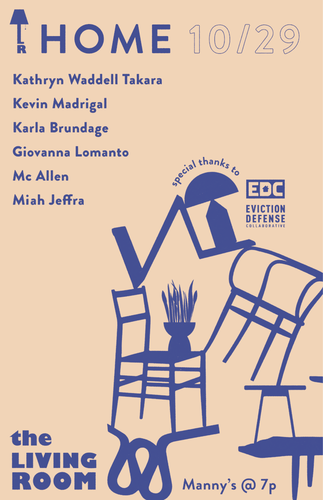
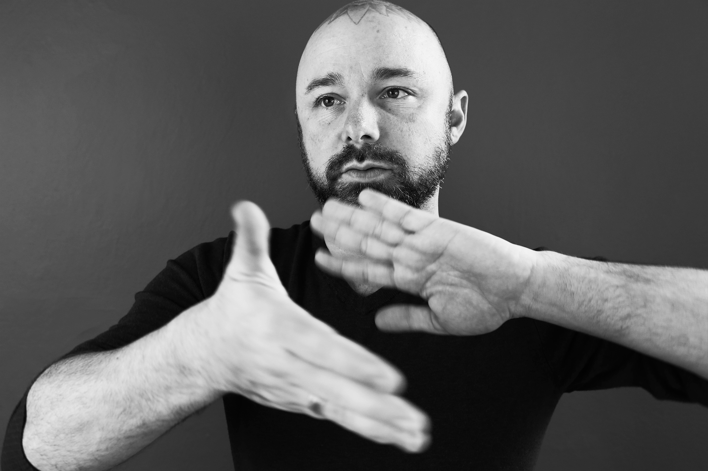
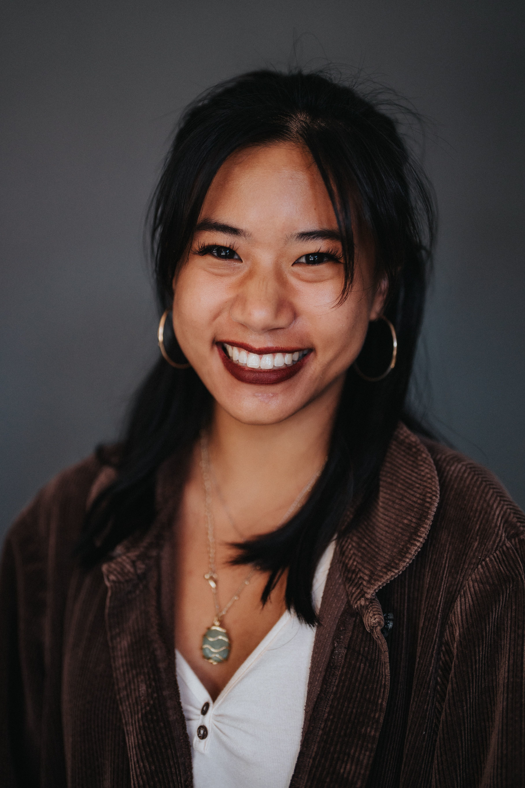
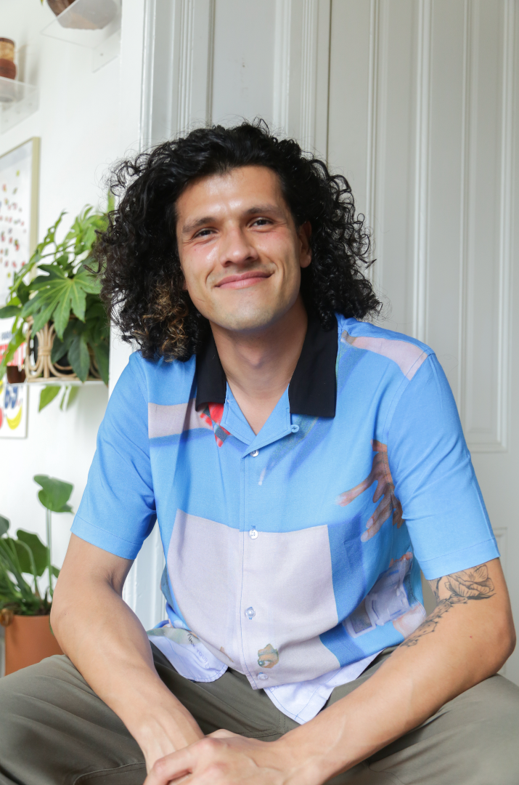
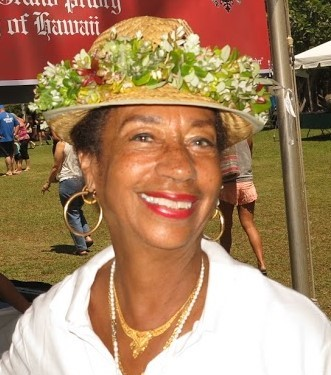

Title: October Show: Home
Slug: 2021-oct
date: 2021-10-15
Summary: The October show theme is "Home" and the featured writers are Mc Allen, Karla Brundage, Miah Jeffra, Giovanna Lomanto, Kevin Madrigal, and Kathryn Waddell Takara.
Lang: en
template: article
header_cover: ../static/images/home-header.png

<iframe width="560" height="315" src="https://www.youtube.com/embed/pLbW1ZMMUOs" title="YouTube video player" frameborder="0" allow="accelerometer; autoplay; clipboard-write; encrypted-media; gyroscope; picture-in-picture" allowfullscreen></iframe>

Hosted by Kevin Dublin and Paolo Bicchieri, the October 2021 show theme is "Home" and the featured writers are:

[**Mc Allen**](https://www.mc-allen.com/) has been reading poems to strangers on the sidewalks of San Francisco since 2004, a hobby he calls ["The Poetry Canvas."](https://www.mc-allen.com/poetry-canvas) More recently, Mc is one of Muni's newest bus drivers. One time winner and one time loser of the Muni Diaries Live Haiku contest, his poems have appeared in the *Bay City Beacon, The San Franciscan* and *San Francisco Magazine*. If your bus seems particularly slow, it might be Mc behind the wheel.

[**Karla Brundage**](https://www.karlabrundage.com/) is a Pushcart Prize nominee, Fulbright teacher and author of *Swallowing Watermelons* and her newest book *Mulatta-Not so Tragic*, was just released and was co-authored with Allison Francis. She has performed her work onstage and online, both nationally and internationally. Her poetry, short stories and essays are in *Konch, Hip Mama, sPARKLE & bLINK, Bamboo Ridge Press, Vibe*.

[**Miah Jeffra**](https://www.miahjeffra.com) is author of four books of prose, most recently *The Violence Almanac* and the forthcoming novel, *American Gospel.* Work can be seen in *StoryQuarterly, Prairie Schooner, The North American Review, Barrelhouse, DIAGRAM, jubilat* and others. Miah is co-founder of Whiting Award-winning queer and trans literary collaborative, [Foglifter Press](https://foglifterjournal.com/), and teaches writing and antiracist studies at Santa Clara University.

[**Giovanna Lomanto**](https://linktr.ee/giovanna_lomanto) is a Bay Area poet and teaching artist with a passion for investigating self-liberation through the arts. An alumnus of U.C. Berkeley and a current MFA candidate at NYU's low-residency program, she finds power in education, and therefore holds a passion for delivering that same power to youth—in classrooms, workshops, and mentorships. Her work has been featured on KALW, the Worth-Ryder Art Gallery, the Flor y Canto Literary Festival, *Box*, and the *Elevation Review*. She is the author of two poetry collections: *no body in particular* (Scrambler Books, 2019) and *jupiter fell out the sky last night* (Bound to Brew, 2021). You can follow her on Instagram [@giovanna_lomanto](https://www.instagram.com/giovanna_lomanto/) for updates on future projects. She currently resides in Oakland, CA with her friends, most notably her lionhead bunny Maggie.

**Kevin Madrigal Galindo** is a [food justice advocate](https://farminghope.org/) that is reimagining health with ancestral Mexican cooking. He is a first-generation Chicano hijo de su chingada madre from South San Francisco by way of Zapopan, Jalisco. His first chapbook *Hell/a Mexican* will be published with [Nomadic Press](https://www.nomadicpress.org/store) in 2022.

After co-founding Black Studies, a branch of Ethnic Studies at the University of Hawaii, **[Kathryn Waddell Takara, PhD](https://en.wikipedia.org/wiki/Kathryn_Waddell_Takara)**, retired from 30 years as a professor there, leaving her mark on generations of students. Takara is an Afro-futurist, eco-poet, and warrior for social justice. With a long career of community organizing, she is a recipient of the many prestigious awards including: The American Book Award for her book, *Collected Poems*, The History Makers National Award, Black Futures Award, Life-Time Achievement (NAACP) award, and was Knighted in the Orthodox Order of St. John. She has produced and performed in hundreds of poetry events both at the University and locally as well as on outer islands, paging the way for Hawaii’s current upsurge in spoken word and poetry, Most recently, she co-produced a jazz night in Honolulu featuring the music of Thelonius Monk, gave presentation at the UN/NGO for OOSJ (Cry Children of the World: The Work and Meaning of Knighthood), and continues her work as a publisher for [Pacific Raven Press](https://pacificravenpress.co/).

Community Partner: The [Eviction Defense Collaborative](https://evictiondefense.org/) is the principal organization in San Francisco helping low-income tenants respond to eviction lawsuits. Each year they provide emergency legal services and rental assistance to over 5,000 tenants in San Francisco.

