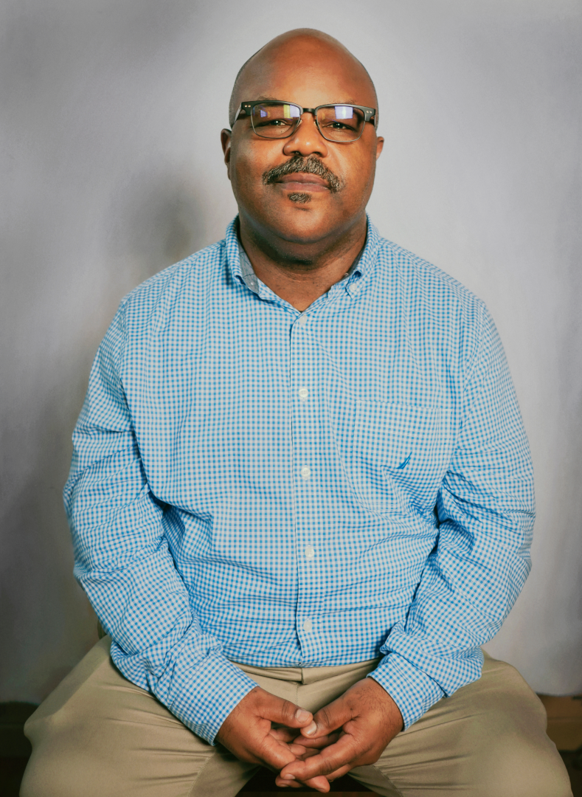
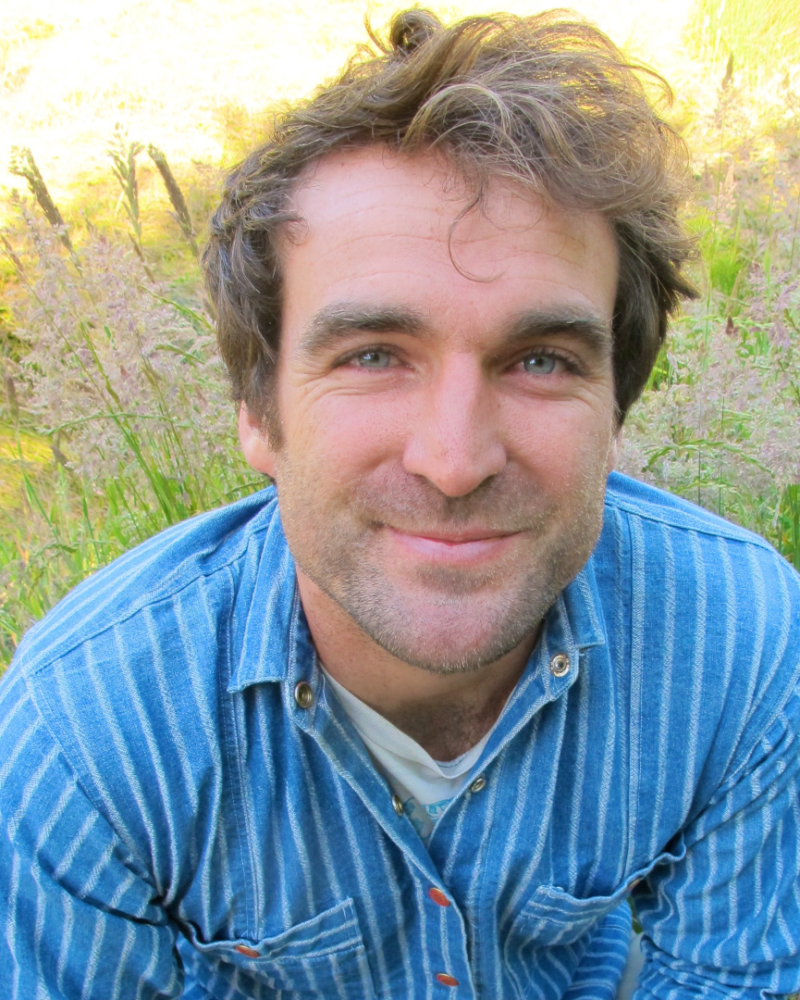
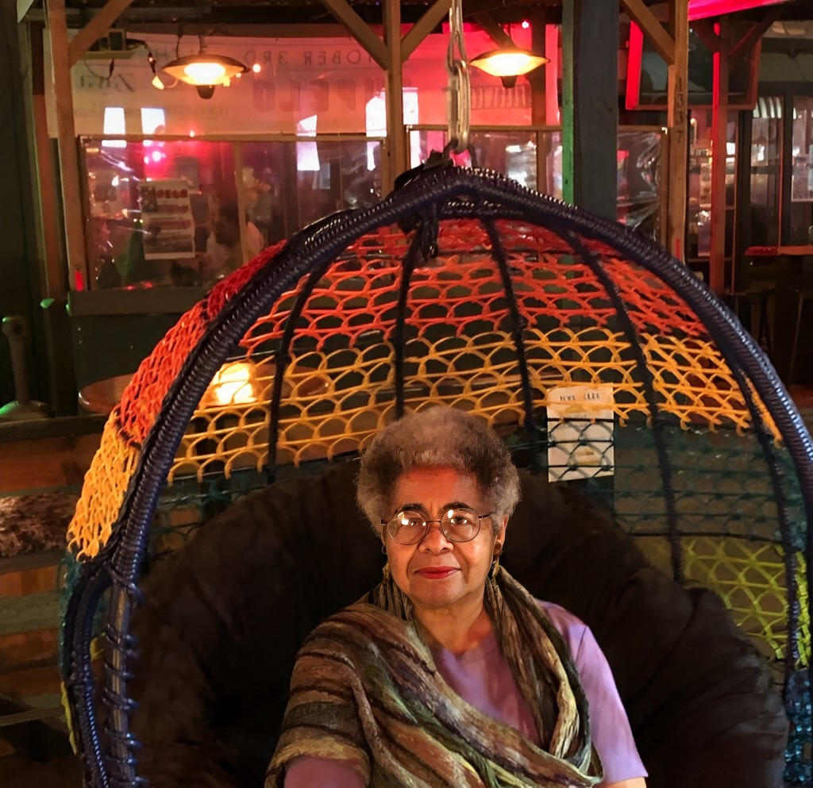
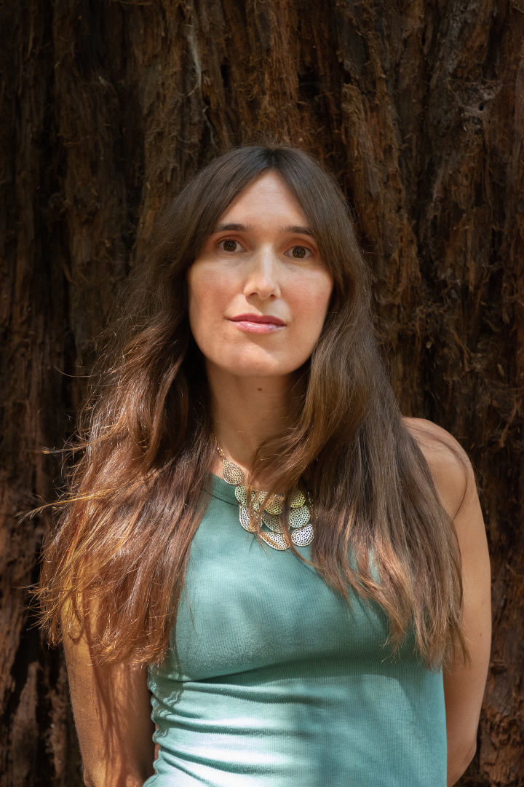

Title: November Show: Resources
Slug: 2021-nov
date: 2021-11-12
Summary: The November show theme is "Resources" and the featured writers are James Cagney, Cal Calamia, Ben Gucciardi, Jeanne Powell, and Erin Rodoni.
video: MLmow7q414U
Lang: en
template: article
header_cover: ../static/images/resources-header.png

<iframe width="560" height="315" src="https://www.youtube.com/embed/MLmow7q414U" title="YouTube video player" frameborder="0" allow="accelerometer; autoplay; clipboard-write; encrypted-media; gyroscope; picture-in-picture" allowfullscreen></iframe>

Hosted by Kevin Dublin and Paolo Bicchieri, the November 2021 show theme is "Resources" and the featured writers are:

[**James Cagney**](https://instagram.com/real_james_cagney) is the author of [*Black Steel Magnolias In The Hour Of Chaos Theory*](https://www.nomadicpress.org/store/blacksteelmagnoliasinthehourofchaostheory), winner of the PEN Oakland 2018 Josephine Miles Award. His newest book, *Martian: The Saint of Loneliness* is the winner of the 2021 James Laughlin Award from the Academy of American Poets. It is due from [Nomadic Press](https://www.nomadicpress.org/) in 2022. For more information, please visit ‪[JamesCagneypoet.com](https://jamescagneypoet.com)‬.

[*Cal Calamia*](https://calcalamia.com) is a bilingual queer trans educator, activist, and poet. His performative work has been featured at many spoken word series across The Bay, and his first book [*San Franshitshow*](https://www.nomadicpress.org/store/sanfranshitshow) was just published by Nomadic Press. Notable accomplishments include impressing a teacher in kindergarten when he correctly spelled vacation and often being told his class is a student’s favorite.

[**Ben Gucciardi**](https://benjamingucciardi.com) was born and raised in San Francisco. His first book, *West Portal*, was selected by Gabrielle Calvocoressi for the [Agha Shahid Ali Prize in Poetry](https://uofupress.lib.utah.edu/west-portal/). He is also the author of the chapbooks *Timeless Tips for Simple Sabotage*, winner of the 2020 Quarterly West Chapbook contest, and *I Ask My Sister’s Ghost* (DIAGRAM/New Michigan Press, 2020). His poems have appeared in outlets such as *AGNI*, *The American Poetry Review*, *Best New Poets*, *Harvard Review*, and *Poetry Daily*. In addition to writing, he works with newcomer youth in Oakland, California.

[**Jeanne Powell**](https://jeanne-powell.com) is a poet, essayist, advocate, publisher, producer of literary events, including at the historic [Mechanic's Institute Library](https://www.milibrary.org/). She's the author of four books of poetry, including her most recent, [*Deeply Nitched Leaves*](https://www.spdbooks.org/Author/Default.aspx?AuthorId=31702). Her work has appeared in several print and online journals, including *Essence* magazine, *Haight-Ashbury Literary Journal*, and the tenth anniversary issue of *Drumvoices Revue*. You can also read her film reviews on [The Stark Insider](https://starkinsider.com/author/jeannep).

[**Erin Rodoni**](https://erinrodonipoet.com/) is the author of three poetry collections, most recently *And If the Woods Carry You*, winner of the [2020 Michael Waters Poetry Prize](https://secure.touchnet.net/C21706_ustores/web/product_detail.jsp?PRODUCTID=403) and out with Southern Indiana Review Press on December 1st. Honors include the 2017 Montreal International Poetry Prize and awards from AWP and *Ninth Letter*. Her poems have been published in *Blackbird*, *Best New Poets*, *Poetry Northwest*, and *EcoTheo*, among others. She teaches at the [Writing Salon](https://www.writingsalons.com/) and raises two small humans.

We didn't record the salon, but we shared ideas around what it would look like if everyone in the bay area had enough resources. There were many ideas from a living wage for all teachers, guaranteed housing, increased access to 24 hour restrooms, and more. One of the things that I like to advocate for especially as a foundation is a [guaranteed income](https://www.teenvogue.com/story/what-is-guaranteed-minimum-income). There are pilot programs happening across the [country](https://www.mayorsforagi.org/), [state](https://www.nbcnews.com/news/us-news/there-s-so-much-need-l-chicago-launch-nation-s-n1283368), and even in [San Francisco](https://www.guaranteedinc.org/) and throughout the [Bay Area](https://www.sfchronicle.com/projects/2021/bay-area-guaranteed-income-programs/). You can find [resources](https://fundforhumanity.org/), [grassroots orgs](https://www.miraclemessages.org/), [advocacy groups](https://www.levelupcalifornia.org/about/policy-platform), and [organizations](https://insightcced.org/about/our-story/) that support the efforts all over. If you're interested in learning more, click around to all of the resources linked above, including the resources linked at the [Gerald Huff Fund for Humanity](https://fundforhumanity.org/our-projects/).

