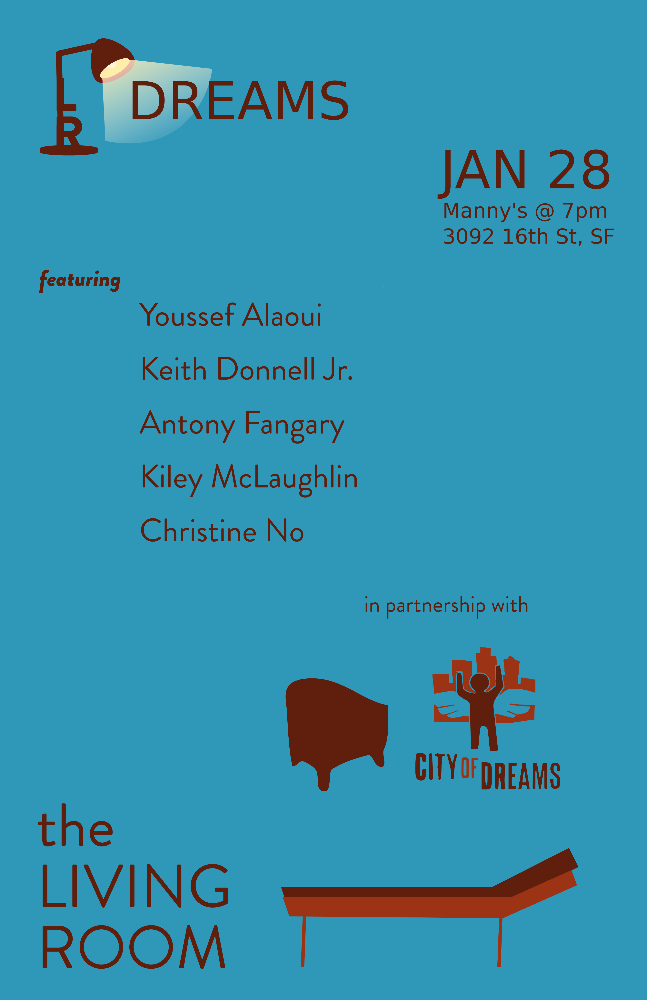
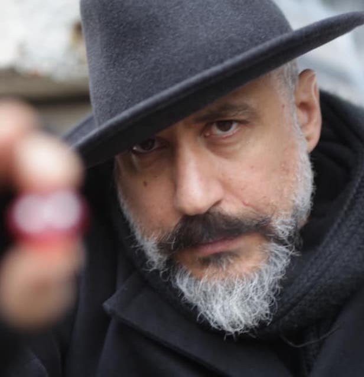
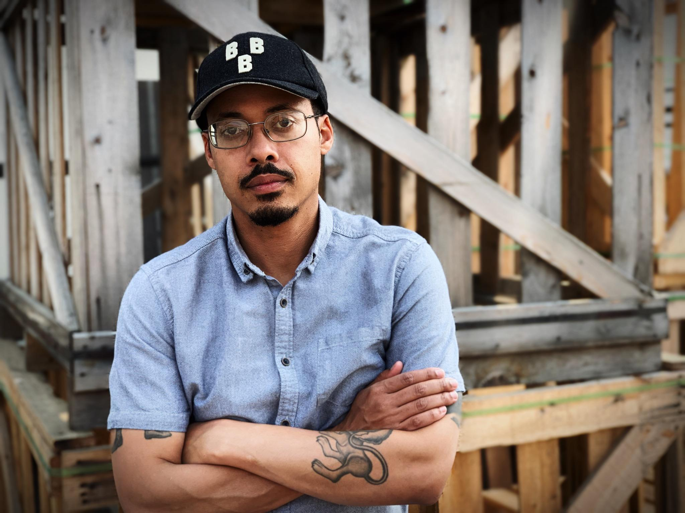
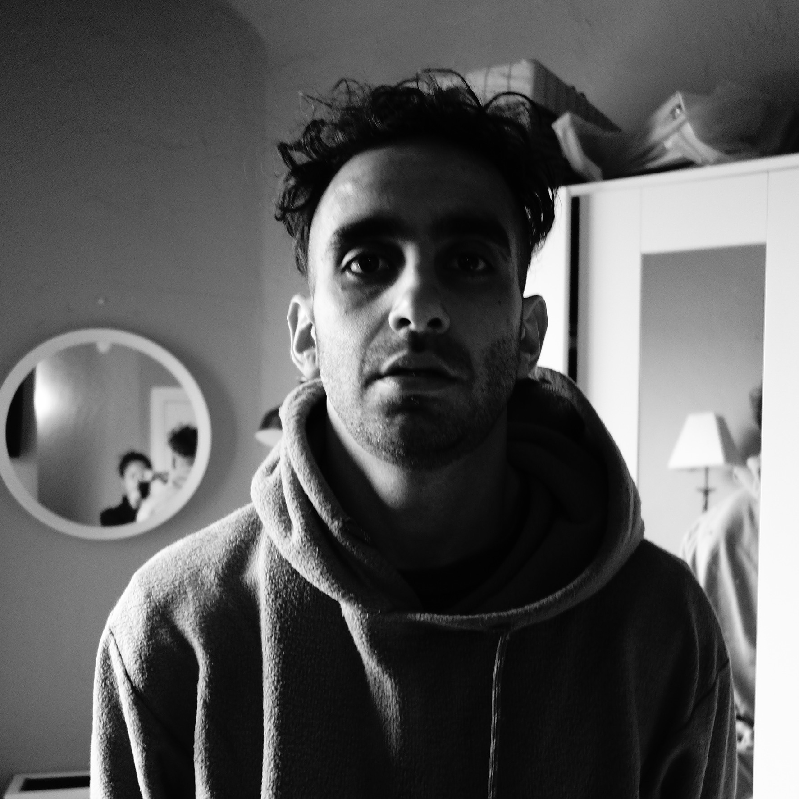
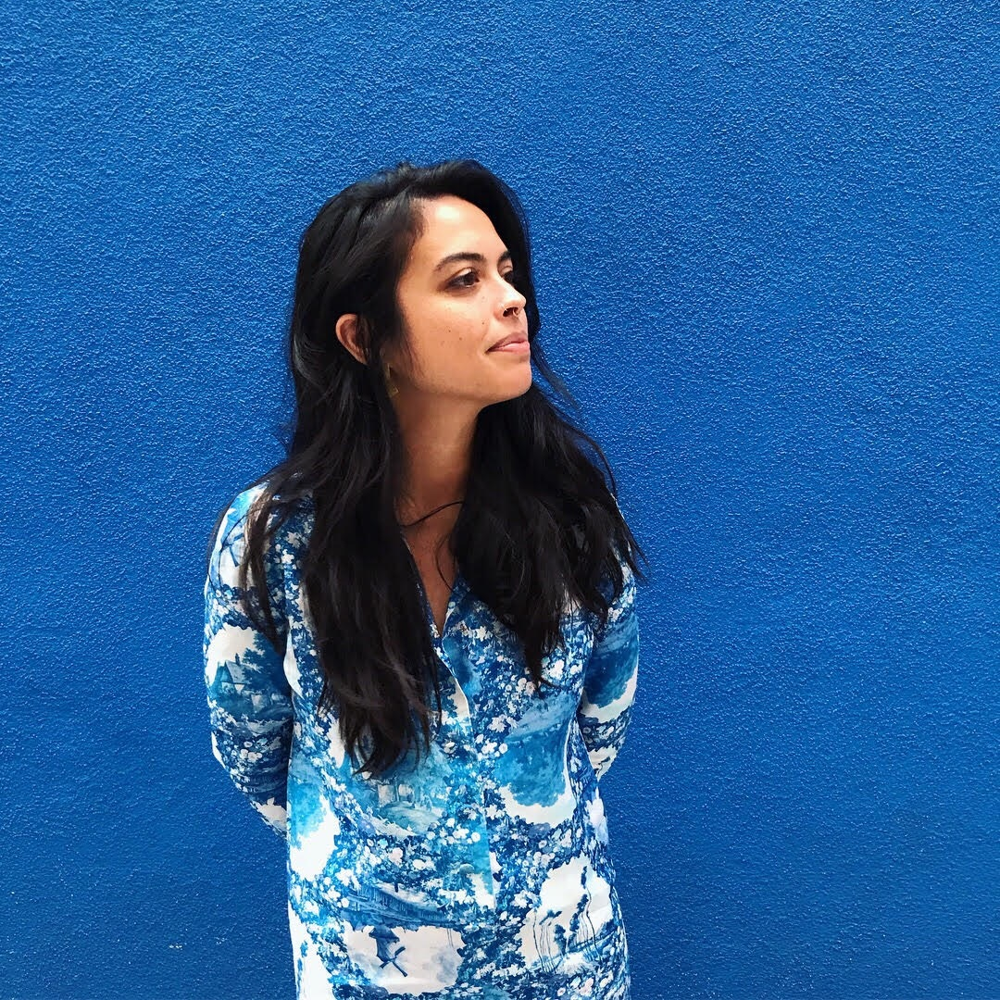
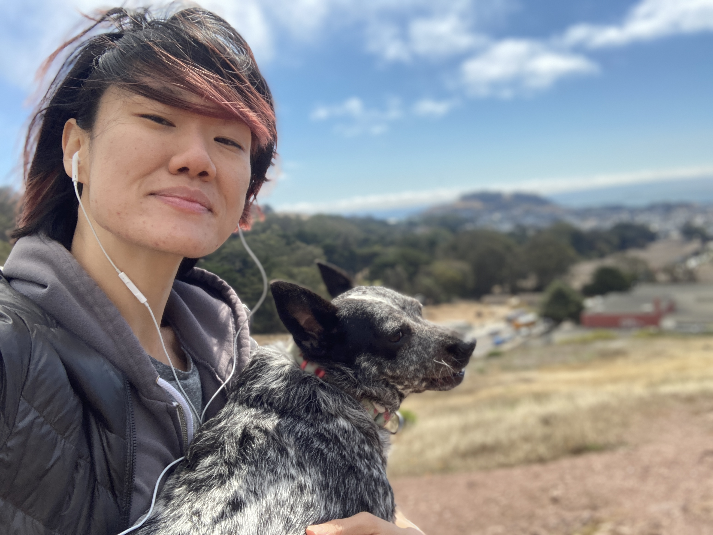

Title: January Show: Dreams
Slug: 2022-jan
date: 2022-1-21
Summary: The January show theme is "Dreams," the community partner is City of Dreams, and the featured writers are Youssef Alaoui, Keith Donnell Jr., Antony Fangary, Kiley McLaughlin, and Christine No.
Lang: en
template: article
header_cover: ../static/images/dreams-header.png

Hosted by Kevin Dublin and Giovanna Lomanto, the January 2022 show theme is "Dreams," the community partner is [City of Dreams](https://www.cityofdreams.org/), and the featured writers are: Youssef Alaoui, Keith Donnell Jr., Antony Fangary, Kiley McLaughlin, and Christine No.

Join us for the [virtual show](https://www.eventbrite.com/e/living-room-reading-series-salon-virtual-tickets-253338661757?aff=LRsite) or [in-person in San Francisco](https://www.eventbrite.com/e/living-room-reading-series-salon-in-person-tickets-253297588907) on January 28, 2022 at 7pm at [Manny's Community Space](https://welcometomannys.com/).

[**Youssef Alaoui**](https://youssefalaoui.info) is a Moroccan American writer. His family and heritage are an endless source of inspiration for his varied, dark, spiritual and carnal writings, including [*Fierer Monsters*](https://www.nomadicpress.org/store/fiercermonsters) and [*Critics of Mystery Marvel*](https://2leafpress.org/online/product/critics-of-mystery-marvel/). He has an MFA in Poetics from New College of California. He is a quiet individual experiencing the swirling cosmos as it taps against his window in a house not far from the sea.

[**Keith Donnell Jr.**](https://www.keithdonnelljr.com/) is a Philly-born poet and book editor. He is the author of one poetry collection, [*The Move*](https://www.nomadicpress.org/store/themove) (Nomadic Press, 2021), with additional work to be found in journals and anthologies, including *Puerto del Sol*, *Best American Nonrequired Reading*, and *POETRY* (Feb 22). 

[**Antony Fangary**](https://antonyfangary.com/) is a Coptic-American poet, educator, and artist living in San Francisco. His poetry has recently appeared or is forthcoming in *The Oakland Review*, *New American Writing*, *Interim*, *The Sycamore Review*, *West Branch*, and elsewhere. His paintings have been featured in art shows around San Francisco and Los Angeles. His chapbook, [*HARAM*](https://www.antonyfangary.com/product-page/haram-etched-press-2018), was published by Etched Press in 2019. Antony was Honorable Mention of the Ina Coolbrith Poetry Prize, Finalist for the 2019 Wabash Poetry Prize, Runner-up for the 2020 Test Site Poetry Series Book Prize, and nominated for multiple Pushcart Prizes. His work has received support from the San Francisco Arts Commission, Yerba Buena Center for the Arts and the Center for Cultural Innovation. Antony holds a Masters of Fine Arts from San Francisco State University and a Bachelors of Arts from the University of California, Davis.

[**Kiley**](https://www.instagram.com/kileymc/) is a Filipinx-American writer and educator living in San Francisco, who is currently pursuing a dual critical/creative doctorate in Literature and Critical Race and Ethnic Studies at UC Santa Cruz. Recent work of hers can be found in *Black Warrior Review*, *Annulet*, *DIAGRAM*, and *Inverted Syntax*, and elsewhere. 

[**Christine No**](https://www.christineno.com) is a Korean American poet, filmmaker and daughter of immigrants. She is a Sundance Alum, VONA Fellow, Pushcart Prize and Best of the Net Nominee. She has served as Assistant Features Editor for [*The Rumpus*](https://therumpus.net/), a Program Coordinator for [VONA](https://www.vonavoices.org/); and currently serves on the board of [Quiet Lightning](https://quietlightning.org/), a literary nonprofit in the Bay Area. Christine is interested in the power of storytelling at the intersection of healing and social justice. You can find her work online and in print; and, her first full length poetry collection [*Whatever Love Means*](https://www.barrelhousemag.com/shopone/whatever-love-means-by-christine-no) is available via Barrelhouse Books. She lives in Oakland with her dog Ruthie Wagmore. 

Community Partner: Join us in supporting [City of Dreams](https://www.instagram.com/cityofdreamssf/)! The City of Dreams Mentoring Program helps San Francisco Youth who live in public housing, ages 8-24, discover and achieve their potential by offering them experiences and mentorship. There are many ways to support from a [single or recurring donations of funds](https://www.classy.org/campaign/city-of-dreamers/c343090) to [volunteering time](https://www.cityofdreams.org/volunteer) as a [full-time mentor](https://www.cityofdreams.org/join-us), in the garden, or as a part of [community campaigns](https://tinyurl.com/AmazonMLKDrive22).
