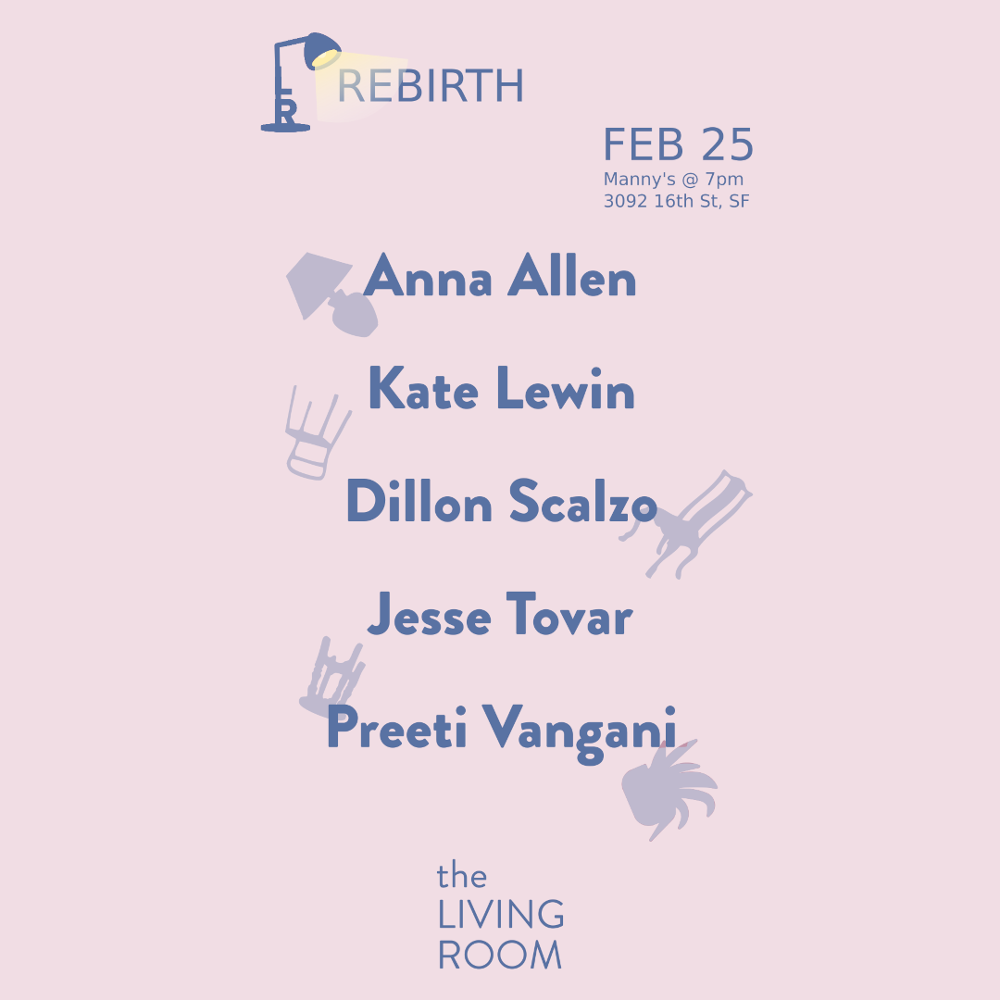
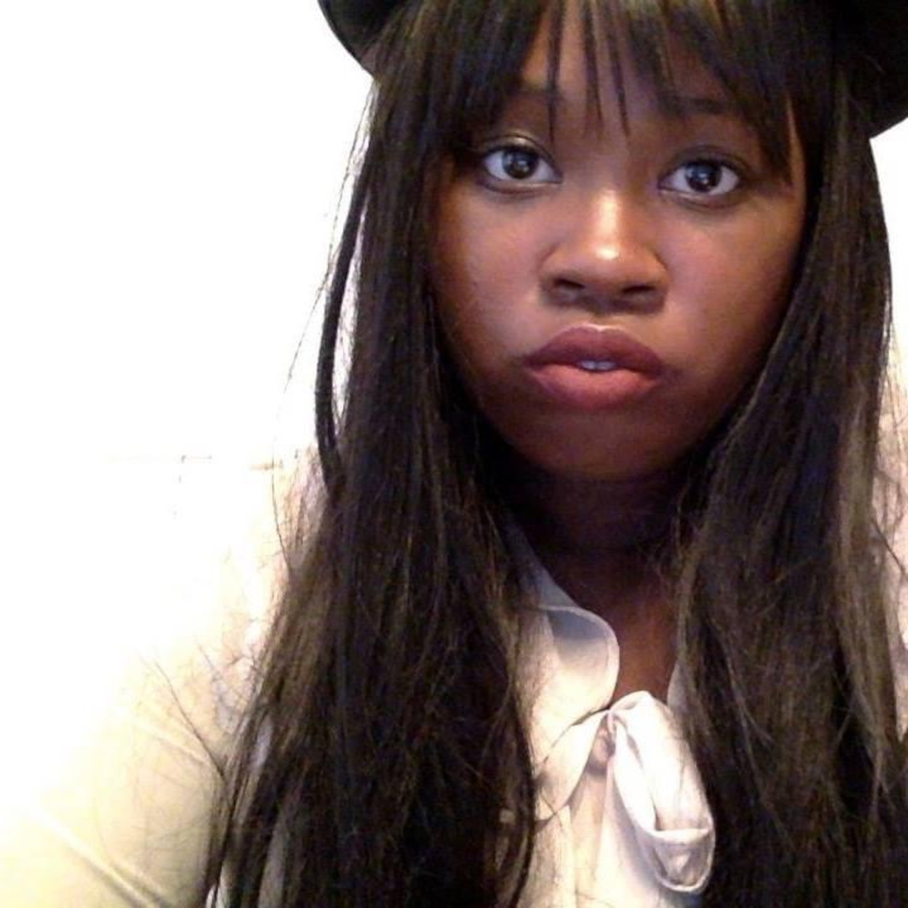
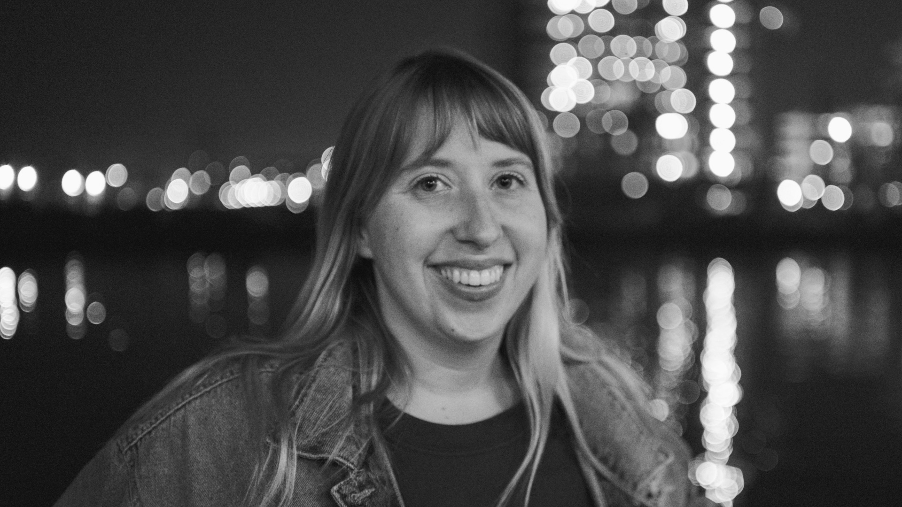
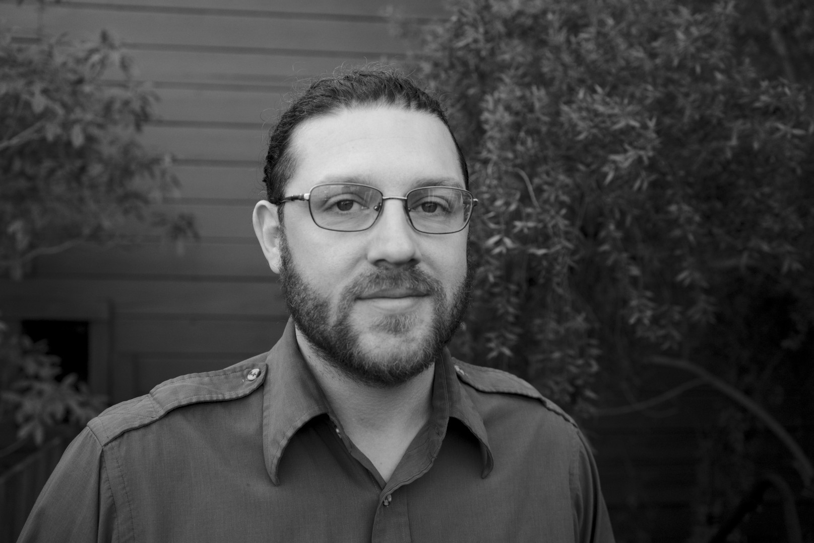
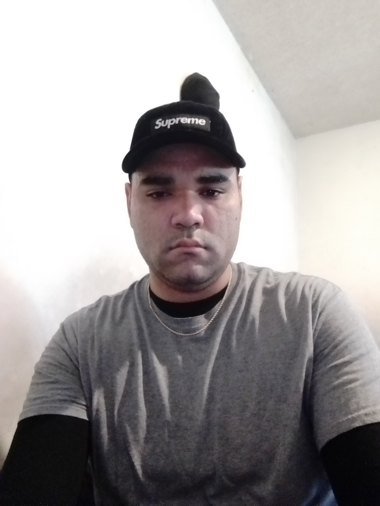
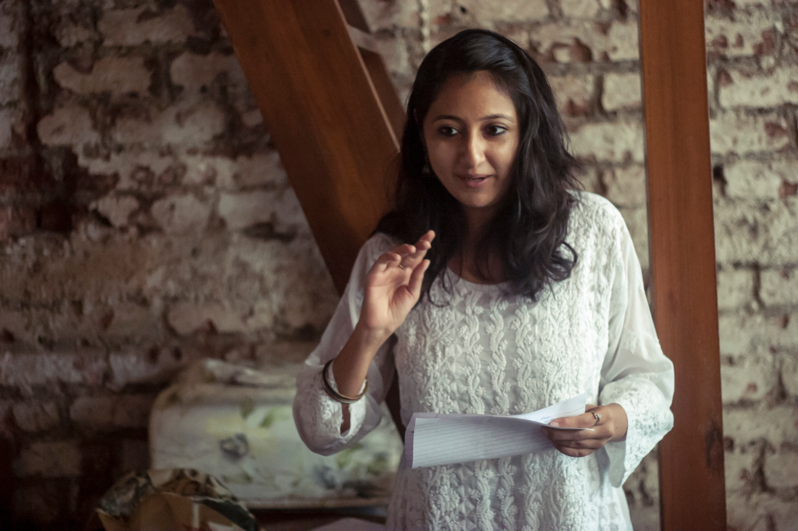

Title: February Show: Rebirth
Slug: 2022-feb
date: 2022-2-25
Summary: The February show theme is "Rebirth" and the featured writers are Anna Allen, Kate Lewin, Dillon Scalzo, Jesse Tovar, and Preeti Vangani.
video: 940NrDTJpFs
Lang: en
template: article
header_cover: ../static/images/header-rebirth.png

<iframe width="560" height="315" src="https://www.youtube.com/embed/940NrDTJpFs" title="YouTube video player" frameborder="0" allow="accelerometer; autoplay; clipboard-write; encrypted-media; gyroscope; picture-in-picture" allowfullscreen></iframe>

Hosted by Kevin Dublin and Giovanna Lomanto, the February 2022 show theme is "Rebirth" and the featured writers are: Anna Allen, Kate Lewin, Dillon Scalzo, Jesse Tovar, and Preeti Vangani.

[**Anna Allen**](https://twitter.com/fancypantsanna) is a performance poet, born in Stockton and living in Oakland. She has been published in online mags, such as Little Death Lit and completed her first book with Nomadic Press, [*I’ve Titled This Poem With Your Name*](https://www.nomadicpress.org/store/p/ivetitledthispoemwithyourname). She is currently attending classes and working on her 2nd book, *Hello I Love You*.

[**Kate Lewin**](https://medium.com/@klewinwriting) is a Bay Area born educator, stepmom and sometimes poet. Manic depressive pixie dream girl and lover of true crime and anything pink. You can find her words at *Lady Clever, Guff, Bold Italic*, and others. If you look deep enough into her eyes, you can see how the universe began—not with “let there be light,” but a bang.

**Dillon Scalzo** is a poet and translator with a passion for working back and forth between the mediums of Spanish and English. Based on the U.S./Mexico border for 13 years in San Diego, CA/Tijuana y Tecate, Baja California, he completed a B.A. in English and Spanish at the University of San Diego and later an MFA in Creative Writing at San Diego State University. He has worked in México, Spain, and in 2016 completed a U.S. Fulbright grant in Uruguay teaching Creative Writing and pursuing translation. Dillon is interested in all things transfronterizo, especially the movement of poetry and art across physical and imaginal borderlands. He currently teaches Creative Writing for WITS Houston, ESL for adults at AEC Texas, and is a translator and museum educator at Contemporary Arts Museum Houston (CAMH).

**Jesse Tovar** is an Event Curator and part-time barista at [My Place Cafe](https://myplacecafe.net/) and a host for [Spectrum Publishing](http://spectrumpublishing.blogspot.com/) in Pasadena, CA. Tovar has been published at *Spectrum*, *The Pen Name Newspaper* as Thomas Till, and two Cal Poly Pomona literary magazines, *Harvest International* and *Pomona Valley Review*. 

[**Preeti Vangani**](https://preetivangani.wixsite.com/poetry) grew up in Mumbai, India and is the author of [*Mother Tongue Apologize*](https://www.indiebound.org/book/9788193929537) (RLFPA Editions, 2019), selected as winner of the RL Poetry Prize. Her work has appeared in *Threepenny Review*, *Gulf Coast*, *Hobart* among other journals, and has been supported by Ucross, Djerassi and California Center for Innovation. Her short story, 'Work Wives' won the 2022 PEN/Robert J. Dau Short Story Prize for Emerging Writers. An alumni of the program, she teaches at the MFA program at University of San Francisco. Preeti is currently working on a manuscript of poems and a collection of short stories. 

