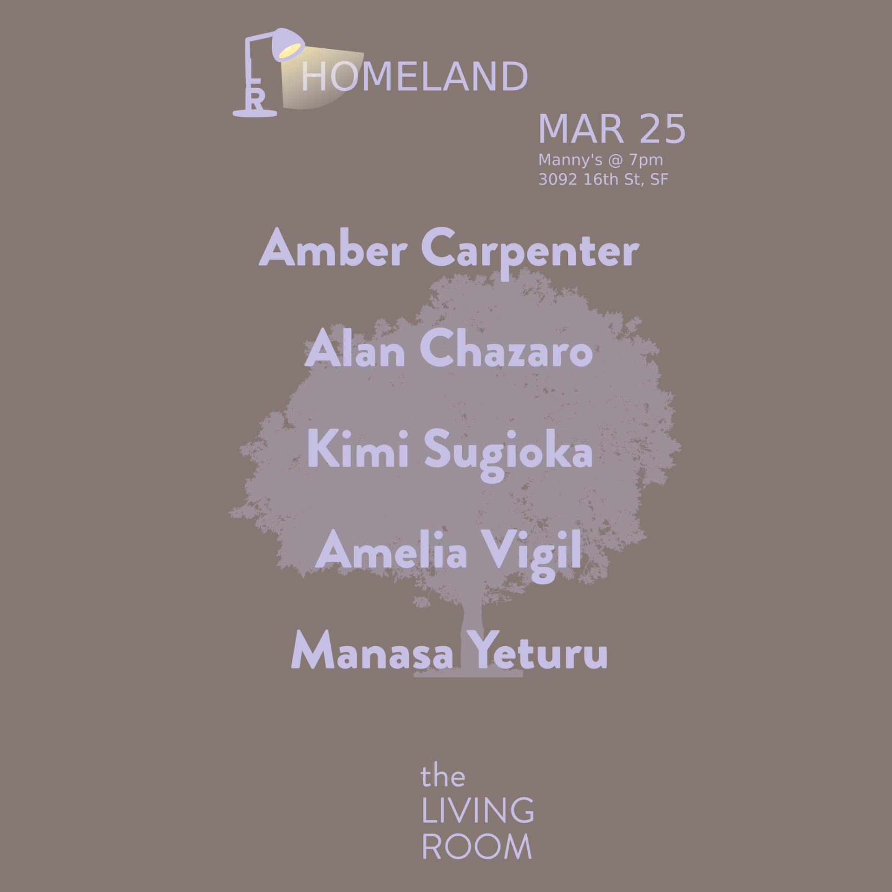
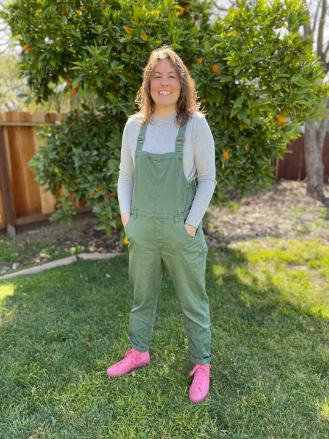
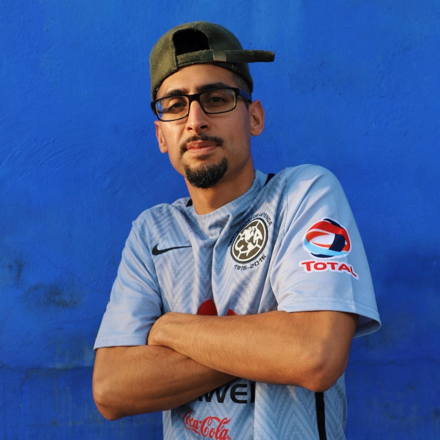
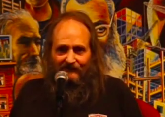
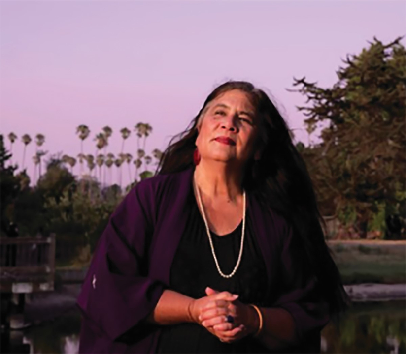
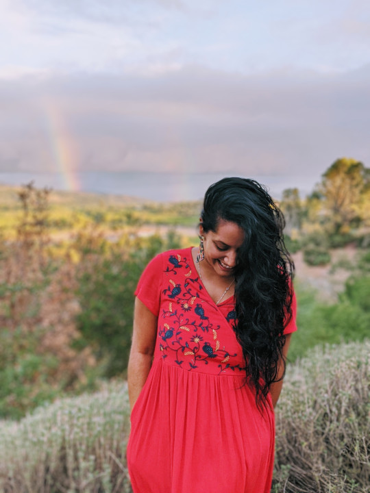

Title: March Show: Homeland
Slug: 2022-mar
date: 2022-3-25
Summary: The March show theme is "Homeland" and the featured writers are: Amber Carpenter, Alan Chazaro, Jack 'Verbal Fish' Fisher, Kimi Sugioka, & Manasa Yeturu.
Lang: en
template: article
header_cover: ../static/images/header-homeland.png

<iframe width="560" height="315" src="https://www.youtube.com/embed/Amk08WyYaBg" title="YouTube video player" frameborder="0" allow="accelerometer; autoplay; clipboard-write; encrypted-media; gyroscope; picture-in-picture" allowfullscreen></iframe>

Hosted by Kevin Dublin and Gionvanna Lomanto, the March 2022 show theme is "Homeland" and the featured writers are: Amber Carpenter, Alan Chazaro, Jack 'Verbal Fish' Fisher, Kimi Sugioka, & Manasa Yeturu.

[**Amber Carpenter**](https://amberleecarpenter.com) earned an MFA in Creative Nonfiction from Columbia College Chicago. She also received an MA in English from East Carolina University. Her essays, hybrids, and photographs have appeared in publications that include *sPARKLE & bLINK*, *Sinister Wisdom*, *Two Hawks Quarterly*, *riverSedge*, and *Camas Magazine*. She currently lives in the Bay Area with her wife, two dogs, and cat.

[**Alan Chazaro**](https://www.alanchazaro.com/) is the author of *This Is Not a Frank Ocean Cover Album* (Black Lawrence Press, 2019) and *Piñata Theory* (Black Lawrence Press, 2020). He is a graduate of June Jordan’s Poetry for the People program at UC Berkeley, a former Lawrence Ferlinghetti Fellow at the University of San Francisco, and co-founding editor of *HeadFake*, an online NBA zine. He chirps about Mexican memes, the Golden State Warriors, and Bay Area rap on Twitter [@alan_chazaro](https://twitter.com/alan_chazaro).

[**Jack Fisher**](https://twitter.com/jackcarterfish2) believes that homeland is where all life began: the sea.

[**Kimi Sugioka**](https://www.lakecountybloom.com/rooted-in-poetry-an-interview-with-alameda-poet-laureate-kimi-sugioka/), poet laureate of Alameda, California, is a poet, songwriter, and educator. She performs her work frequently throughout the Bay Area and is the author of two books of poetry, including the newest, *Wile & Wing* (Manic D Press). She has worked in public education for decades, and earned her BA from San Francisco State University and MFA from the Naropa Institute in Boulder, Colorado.

[**Manasa Yeturu**](https://www.instagram.com/myeturu/) is Educator by day as well as a community-centered Designer & Advocate. By night, she's a spoken word poet, choreographer & deep sea diver. 
