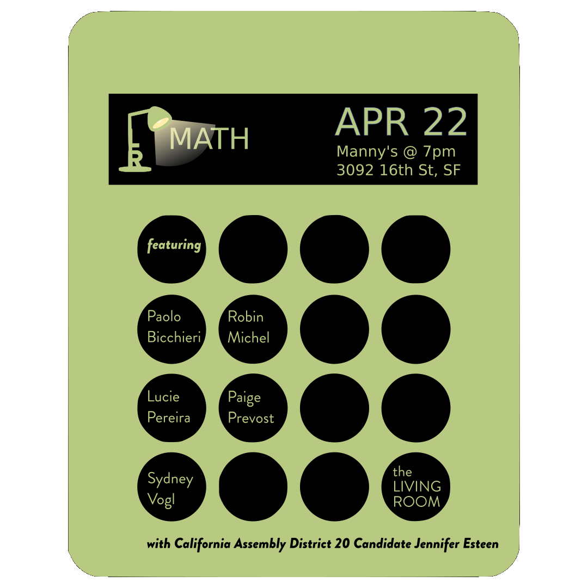
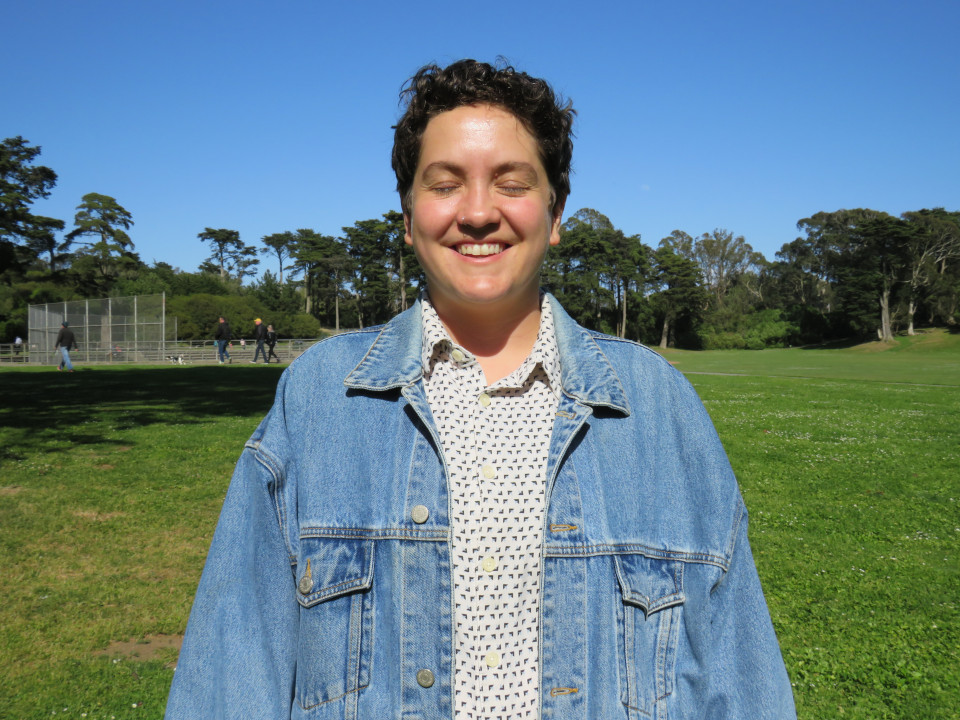

Title: April Show: MATH
Slug: 2022-apr
date: 2022-4-22
Summary: The April 2022 show theme is "Math," the community partner is CA Assembly Candidate Jennifer Esteen, and the featured writers are: Paolo Bicchieri, Robin Michel, Lucie Pereira, Paige Prevost, & Sydney Vogl.
Lang: en
template: article
header_cover: ../static/images/header-math.png
cover: ../static/images/4-22-show.png

<iframe width="560" height="315" src="https://www.youtube.com/embed/MEFZlFuZ_q4" title="YouTube video player" frameborder="0" allow="accelerometer; autoplay; clipboard-write; encrypted-media; gyroscope; picture-in-picture" allowfullscreen></iframe>

Hosted by Kevin Dublin and Paolo Bicchieri, the April 2022 show theme is "Math," the community partner is CA Assembly Candidate Jennifer Esteen, and the featured writers are: Paolo Bicchieri, Robin Michel, Lucie Pereira, Paige Prevost, & Sydney Vogl.

[**Paolo Bicchieri**](https://www.paolobicchieri.com) is a writer living on the coast. His fourth book and first book of poetry, *Familial Animals*, was released by Animal Heart Press in the fall of 2021. His poems have appeared in *Bay Area Generations*, *Quiet Lightning*, Nomadic Press, Ghost City Press, and more. He is a reporter for *Eater SF* and will complete a graduate degree focused on culture, power, and social movements for coffee workers in the Chiapas state of Mexico in May 2022. He thinks teachers deserve the money that cops do not. 

[**Robin Michel**](https://robinmichelwriter.com/), who has a master’s degree in Educational Leadership from Mills College, has over twenty years’ experience working for nonprofits and educational institutions and is working as a communications consultant for Santa Rosa Junior College. She belongs to poetry collectives in the East Bay and in San Francisco, and her work is found in many online and print journals. In 2019, she founded [Raven & Wren Press](), an independent publishing house, to release poet Florence Miller’s *After Rain a Little Girl Straightening Worms*. In 2020, she published *HOW TO BEGIN: Poems, Prompts, Tips and Writing Exercises by the Fresh Ink Poetry Collective to improve your poetry practice—or start a group of your own*.

[**Lucie Pereira**](https://twitter.com/lucieisbrown) (she/her) is a San Francisco-based writer and educator. Her work has appeared in *Honey Literary*, *The Hellebore*, *Yes Poetry*, and *Zone 3*, among others. She teaches creative writing for youth at 826 Valencia and Children's After School Arts.

[**Paige Prevost**](https://wtpaige.net/) is a recent transplant to the Bay Area, moving here from Los Angeles, but was born and raised in Beaumont, TX #409. She loves slice of life, learning new things, contradictions, and imagining the worlds people live in. And eventually, yes, she will submit that poem.

[**Sydney Vogl**](https://sydneyvogl.com/) recently won the Jane Underwood Poetry prize. She was the winner of the 2021 AWP Intro Journals Award & received a poetry fellowship from Martha’s Vineyard Institute for Creative Writing. Her debut chapbook, *CALIFORNIA IS GOING TO HELL*, was released in November 2021. She currently serves as a poetry editor for *The San Franciscan* Magazine and will be teaching Intro to Creative Writing at USF in the fall.

Community Partner: Join us in supporting progressive California AD candidate [Jennifer Esteen](https://www.jenniferesteen.com/)! Jennifer is a nurse, mother, and trustee of Alameda Health Systems, and has already helped usher legislation into existence. She knows firsthand the struggles that our families and communities face and will work tirelessly to ensure corporations and special interests pay their fair share, so everyone has access to housing they can afford, healthcare they deserve, and a quality education. She was even game to [share a limerick in the Living Room](https://youtu.be/u4ZmyxNt1Nc)! There are many ways to support her: a [single or recurring donations of funds](https://secure.actblue.com/donate/jennifer-esteen--rn-for-assembly-2022-1) or [volunteering time](https://www.mobilize.us/jenniferesteen/). Check her [endorsements here](https://www.jenniferesteen.com/endorsements).
