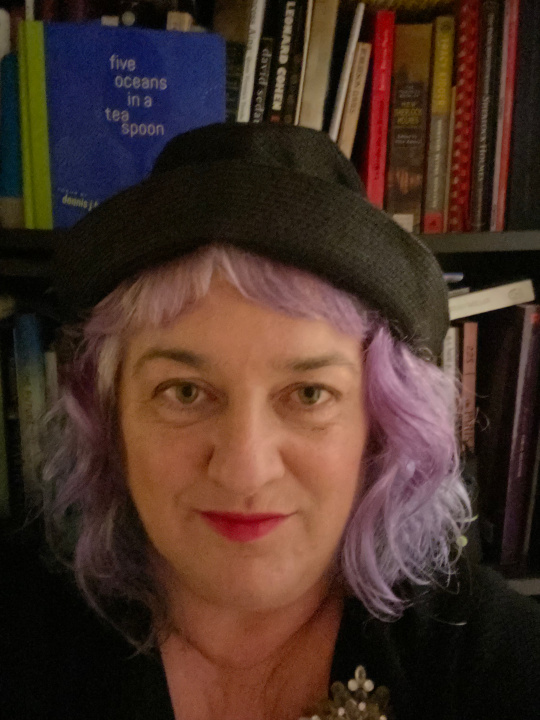

Title: May Show: Mindfulness
Slug: 2022-may
date: 2022-5-27
Summary: The May 2022 show theme is "Mindfulness," and the featured writers are: Gabrielle DeGray, Kevin Dublin, Georgina Marie Guardado, Kelliane Parker, & Dena Rod.
Lang: en
template: article
header_cover: ../static/images/header-mindfulness.png
cover: ../static/images/5-27-show.png

<iframe width="560" height="315" src="https://www.youtube.com/embed/NtyDhQkXcMk" title="YouTube video player" frameborder="0" allow="accelerometer; autoplay; clipboard-write; encrypted-media; gyroscope; picture-in-picture" allowfullscreen></iframe>

Hosted by Kevin Dublin and Giovanna Lomanto, the May 2022 show theme is "Mindfulness," and the featured writers are: Gabrielle DeGray, Kevin Dublin, Georgina Marie Guardado, Kelliane Parker, & Dena Rod. Georgina Marie was unable to make it this night, and will join in a future show.

**Gabrielle DeGray** is a writer who lives in the San Francisco Bay Area. She has been published in the *New York Times*, *Chesapeake Review*, *The Mindful Word*, and *Yellow Arrow Literary Magazine*. She holds an MA from the University of Toronto and is currently at work on a memoir. 

**[Kevin Dublin](https://www.kevindublin.com)** is an educator, editor, and writer of poetry, prose, scripts, and code. Currently Director of the Elder Writing Project, a community-based outreach program of the Litquake Foundation, Kevin loves teaching in the community. He is a Writers Studio Ralph Dickey Scholar and has received fellowships, grants, and awards from the San Francisco Arts Commission (SFAC), Center for Cultural Innovation (CCI), Martha’s Vineyard Institute of Creative Writing, and the North Carolina Poetry Society.  His words have recently appeared or forthcoming in *The San Franciscan*, *Cincinnati Review*, *North Carolina Literary Review*, & more. He is author of the chapbook *[How to Fall in Love in San Diego](https://www.finishinglinepress.com/product/how-to-fall-in-love-in-san-diego/)*, and he believes in you.

**[Georgina Marie](https://georginamariepoet.com)** is the Lake County Poet Laureate for 2020-2024, & a Poets Laureate Fellow with The Academy of American Poets. She has received support from the Mendocino Coast & Napa Valley Writers’ Conferences. Her work has appeared in *The Bloom*, *Noyo Review*, & *Poets.org*, and is forthcoming in *Gulf Coast*, *Colossus:Freedom*, and *Yellow Medicine Review*. 

**[Kelliane Parker](https://kellianeparkerpoetry.com/)** is a queer, Latinx street poet, living with Dissociative Identity Disorder and the author of *Down the Foggy Streets of my Mind*, [from Nomadic Press](https://www.nomadicpress.org/store/p/downthefoggystreetsofmymind).

**[Dena Rod](https://www.denarod.com/)** is a trans non-binary poet whose work has been widely published and highlighted in *My Shadow is My Skin: Voices from the Iranian Diaspora*, *The Rumpus*, and more. Described by *The Bold Italic* as a “verbose advocate,” their debut poetry collection, *Scattered Arils* is now in its third printing from [Milk and Cake Press](https://milkandcakepress.com/product/scattered-arils-by-dena-rod/). Rod’s literary endeavors include curating poetry showcases, speaking on panels, and visiting classrooms for community engagement with a focus on queer and trans Iranian diaspora issues. Connect with Dena at their website, denarod.com.

Kevin would also like to extend a special thank you to the [San Francisco Arts Commission](https://www.sfartscommission.org/grants) for funding time to work on the poems read as a part of this show. If you are an individual artist and have any interest in applying for funding, [please reach out to me](mailto:kevin@thelivingroomsf.com), and I will help out in any way I can. We are all in this together. Your work deserves to be shared. Take care.

