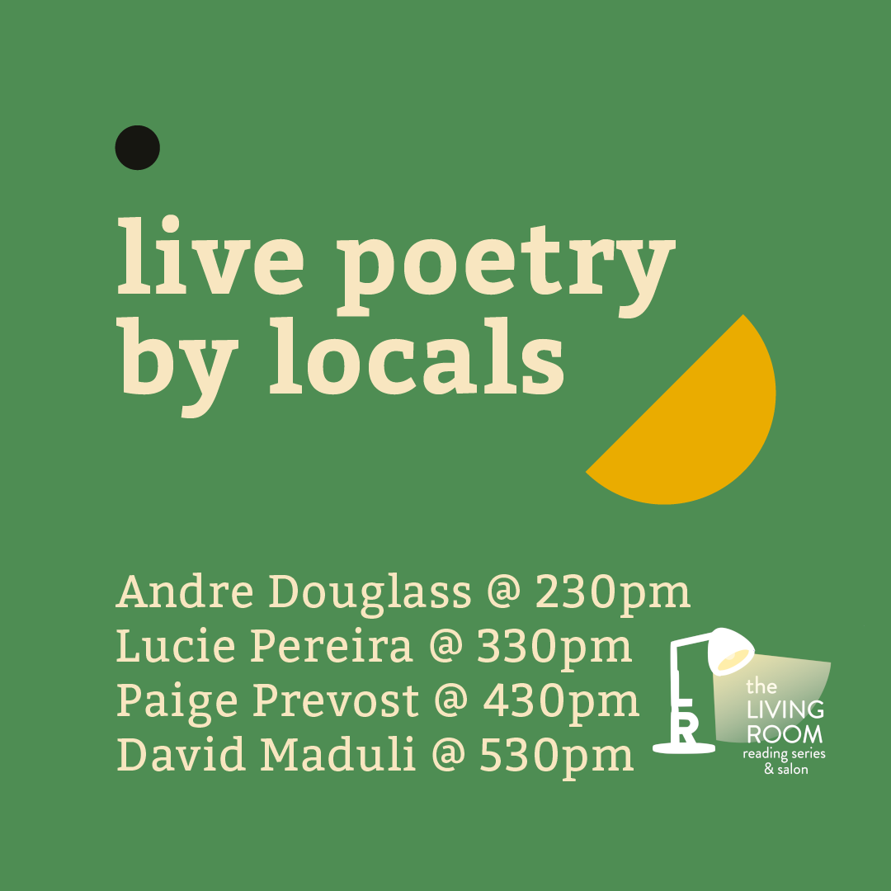
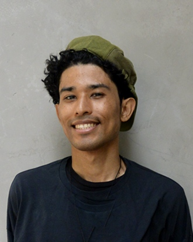
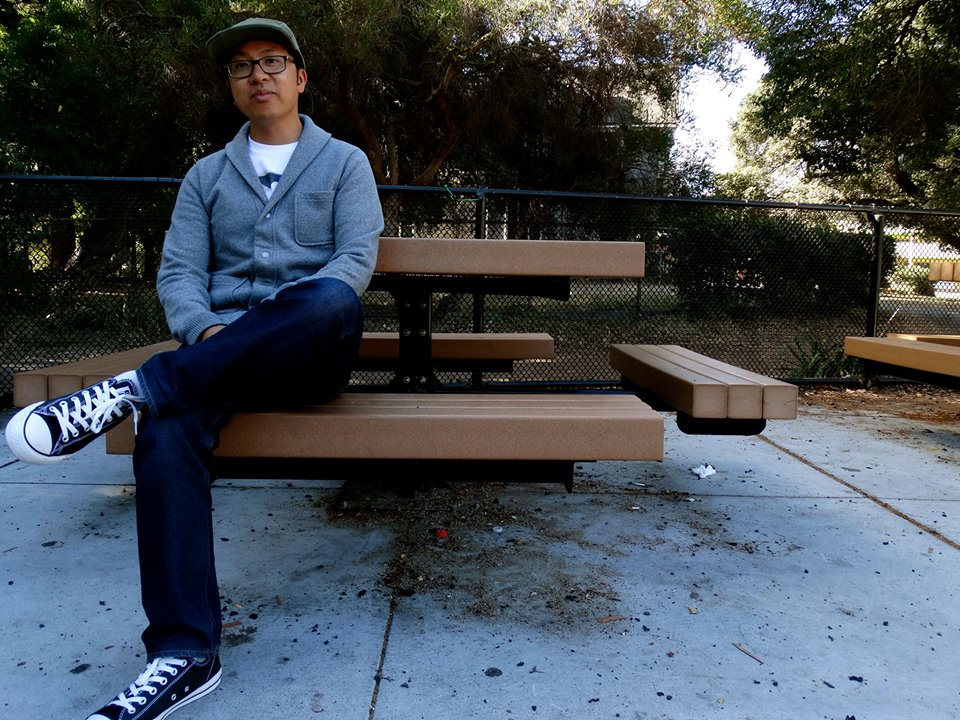
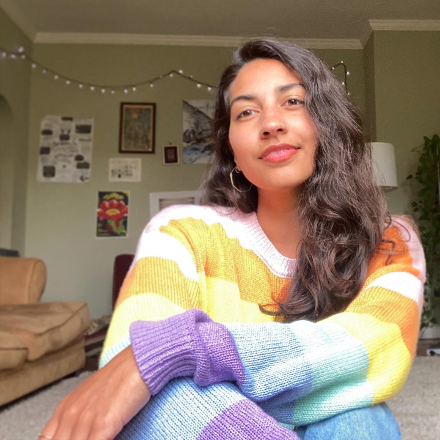
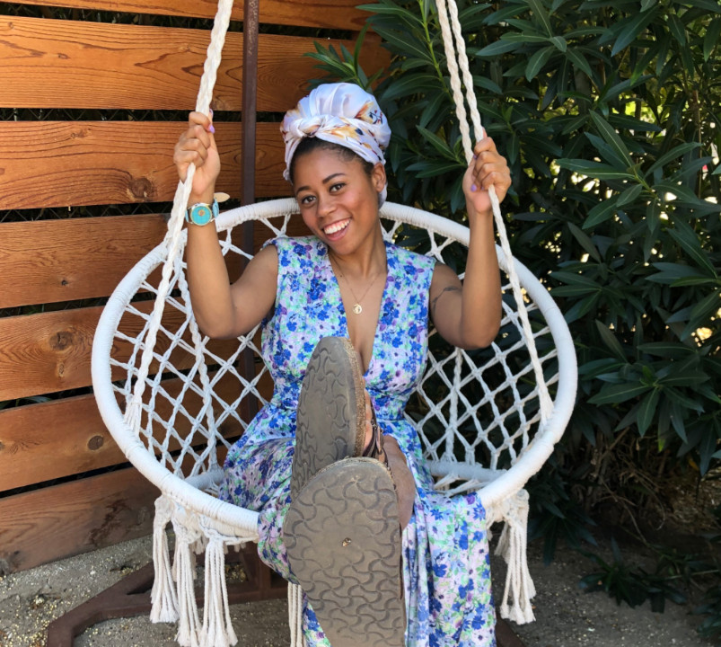

Title: July Show at the Syzygy Art Market
Slug: 2022-july
date: 2022-7-30
Summary: The July 2022 show is a collaboration at the Syzygy SF Art Market and featured writers are: Andre Douglas, David Maduli, Lucie Pereira, and Paige Prevost.
video: -ZPHTqk-6G8
Lang: en
template: article
header_cover: ../static/images/header-art-market.png
cover: ../static/images/7-22-show.png

<iframe width="560" height="315" src="https://www.youtube.com/embed/-ZPHTqk-6G8" title="YouTube video player" frameborder="0" allow="accelerometer; autoplay; clipboard-write; encrypted-media; gyroscope; picture-in-picture" allowfullscreen></iframe>

Hosted by Kevin Dublin, the July 2022 show was a feature in the Syzygy SF Art Market and the featured writers are: David Maduli, Lucie Pereira, Paige Prevost, Andre Douglas.

**Andre Douglas** is an Afro-Latinx creative writer based in San Francisco and orginally from San Jose. He is a lover of jazz, poetry, and insurgent art. As a Programs Coordniator at 826 Valencia, Andre supports under-resourced students with their creative and expository writing skills. He is a Stanford University graduate and has a passion for education and community empowerment.

**[David S. Maduli](https://www.instagram.com/dmad_ness/)** is a father of two, veteran public school teacher, deejay and author of the chapbook *00:33:33 (thirty-three and a third)* (Zoetic Press, 2018). He is an alumnus of the VONA, Las Dos Brujas and Napa Valley Writers’ workshops and he was the 2011 recipient of the Joy Harjo Poetry Prize. A descendant of Filipino immigrants born in San Francisco and raised all over, he is a longtime resident of Oakland, CA. He completed his MFA in Creative Writing at Mills College with a fellowship in Community Poetics.

[**Lucie Pereira**](https://twitter.com/lucieisbrown) (she/her) is a San Francisco-based writer and educator. Her work has appeared in *Honey Literary*, *The Hellebore*, *Yes Poetry*, and *Zone 3*, among others. She teaches creative writing for youth at 826 Valencia and Children's After School Arts.

[**Paige Prevost**](https://wtpaige.net/) is a recent transplant to the Bay Area, moving here from Los Angeles, but was born and raised in Beaumont, TX #409. She loves slice of life, learning new things, contradictions, and imagining the worlds people live in. And eventually, yes, she will submit that poem.

