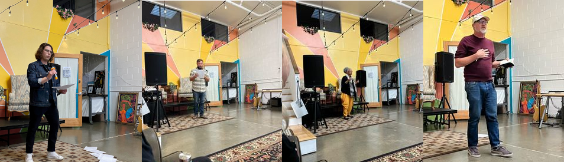
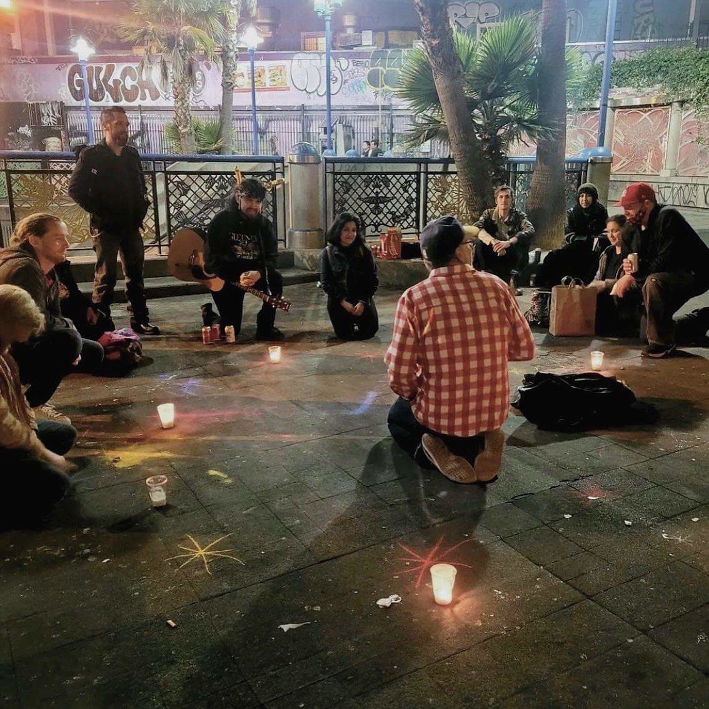
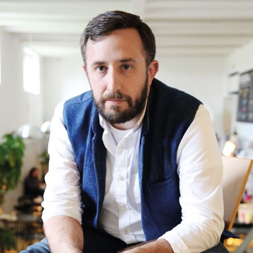
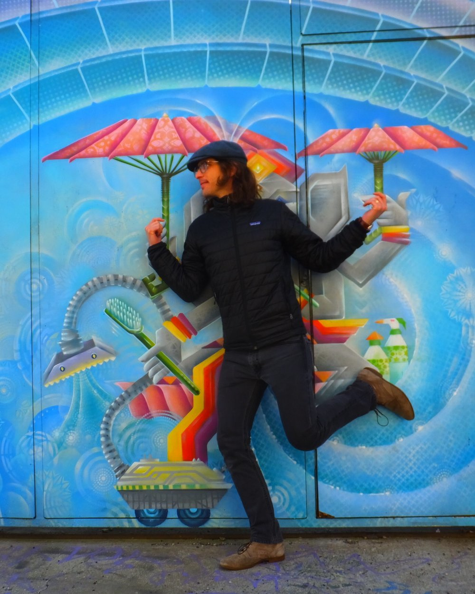

Title: August Show: Escapism
Slug: 2022-August
date: 2022-8-26
Summary: The August 2022 show theme is *Escapism* and the featured writers are: Charlie Getter, Frank Karioris, Tureeda Mikell, & Evan Schanir.
video: 77QtXztk_i4
Lang: en
template: article
header_cover: ../static/images/header-escapism.png
cover: ../static/images/8-22-show.png

<iframe width="560" height="315" src="https://www.youtube.com/embed/77QtXztk_i4" title="YouTube video player" frameborder="0" allow="accelerometer; autoplay; clipboard-write; encrypted-media; gyroscope; picture-in-picture" allowfullscreen></iframe>

Hosted by Kevin Dublin and Giovanna Lomanto, the theme is "Escapism" and the featured writers are: Charlie Getter, Frank Karioris, Tureeda Mikell, and Evan Schanir.

[**Charlie Getter**](https://sfstandard.com/arts-culture/renegade-writers-bring-spoken-word-to-16th-st-mission-bart/) does poems on a street corner... and has for every Thursday for almost two decades. Sometimes those poems end up in books like *How to Arrange Physics & Geography to Your Advantage* or *Lessons in Chaos Navigation*.

[**Frank G. Karioris**](https://twitter.com/frankgkarioris) (he/they/him/them) is a writer and educator based in San Francisco whose writing addresses issues of friendship, gender/sexuality, and class. Their work has appeared or is forthcoming in *Pittsburgh Poetry Journal*, *Collective Unrest*, *Maudlin House*, *Sooth Swarm Journal*, and *Crêpe & Penn* amongst others.

[**Tureeda Mikell**](https://www.instagram.com/storymedicinewoman/?hl=en), Story Medicine Woman, is an award-winning poet whose work has been published in many languages. She was cited as an “Activist for Holism” by an Iranian doctorial scholar. She has published 73 anthologies of classroom writings authored by at-risk students. She is also a UC Bay Area Writing Project Fellow; the author of *Synchronicity: The Oracle of Sun Medicine*, nominated for the California Book Award; and the co-author/curator of EastSide Arts Alliance’s *Patrice Lumumba Anthology* (Nomadic Press). She was Oakland Museum Poet-in-Residence 2006 and was recently named 2022 Poet-in-Residence at the Museum of the African Diaspora.

[**Evan Schnair**](https://www.evanschnair.com/) is a poet and educator. Evan’s Readymades visual poetry project (2017) was on exhibit in a series of 45 panels arranged into clusters. His other poetry project includes poems in conversation with Jewish prayers composed for The Kitchen's Siddur (2013 and 2017) and Machzor (2014) prayer books. Evan's collaborative performance poem was part of the Poet's Theater festival hosted by Small Press Traffic in 2015. Readers can find Evan's poems in Shampoo Poetry, Monday Night, elimae, and the Plaid Review. Evan has an MFA in Writing from California College of the Arts and lives in San Francisco with his wife and children.

