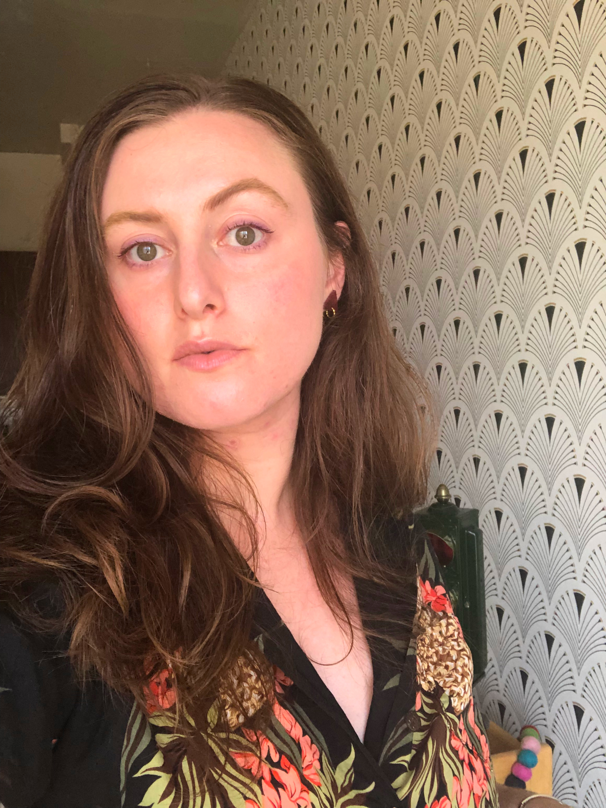

Title: September Show: Environment
Slug: 2022-september
date: 2022-9-23
Summary: The September 2022 show theme is *Environment* and the featured writers are: Sophia Cross, Hadas Goshen, Rhea Joseph, Amanda Moore, and Giorgia Sage.
video: cbxKHTMTLKk
Lang: en
template: article
header_cover: ../static/images/header-environment.png
cover: ../static/images/9-22-show.png

<iframe width="560" height="315" src="https://www.youtube.com/embed/cbxKHTMTLKk" title="YouTube video player" frameborder="0" allow="accelerometer; autoplay; clipboard-write; encrypted-media; gyroscope; picture-in-picture" allowfullscreen></iframe>

Hosted by Kevin Dublin and Katie Aliféris, the theme is "Environment" and the featured writers are: Sophia Cross, Hadas Goshen, Rhea Joseph, Amanda Moore, and Giorgia Sage.

[**Sophia Cross**](https://twitter.com/snailsnacks) is a writer born and raised in the Bay Area. She spent several years as an event programmer and operations manager for Litquake, San Francisco's literary festival. Her essays have appeared in *The New Inquiry* and *Bright Wall/Dark Room*.

[**Hadas Goshen**](https://hadasgoshen.com/) is a San Francisco based poet and former journalist, whose words have been published in the *New York Times*, *Oprah Magazine*, and more. Previously, Hadas volunteered as an interim board member for SF's literary non-profit [Quiet Lightning](https://quietlightning.org/), and hosted YouTube's monthly open mic series for musicians and writers. These days you can find Hadas in the Mission, where she is currently working on her first book of prose, and reading poems to her plants. 

[**Rhea Joseph**](https://www.instagram.com/rheality_check_/) is an energetic, STEM-loving poet who comes from a family of artists and creatives. She is passionate about mental health, wellness, and technology. She currently lives in San Francisco, but writes from a global perspective, intertwining her experience of growing up in India and blooming in Boston’s Back Bay neighborhood. She graduated from Northeastern University with degrees in Psychology and Communication Studies, along with concentrations in Data Science and Business. Rhea finds power in community and can be found experimenting with new performance styles at the 16th & Mission open mic.

[**Amanda Moore**](https://amandapmoore.com/) is the author of *Requeening*, selected by Ocean Vuong for the National Poetry Series. She is a high school teacher and lives in the Outer Sunset neighborhood of San Francisco.

[**Giorgia Sage**](https://giorgiasage.com/)  is a writer born, raised, and living in San Francisco, California. Their work explores ecologies of care and scales of intimacy between people, places, and things. They can usually be found with their cats or getting lost on their bicycle. If you're interested in [acquiring their zines, visit Instagram](https://www.instagram.com/giorgiasage/).

