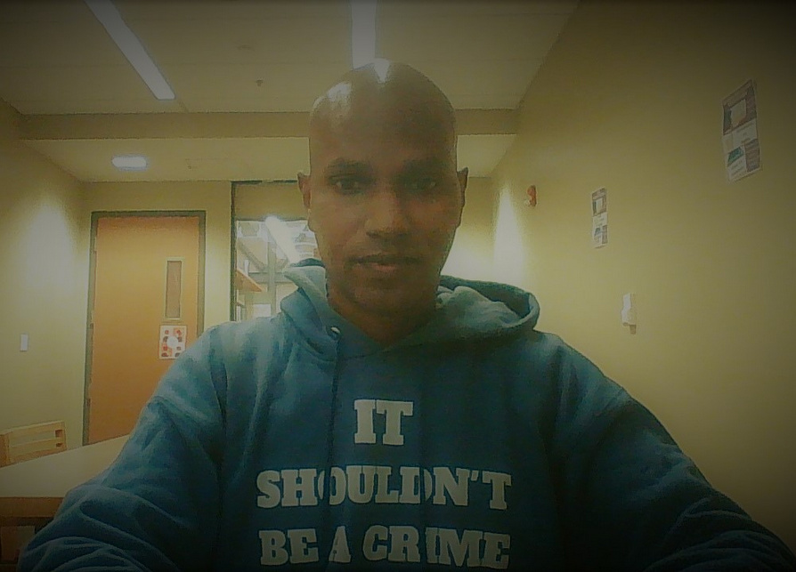
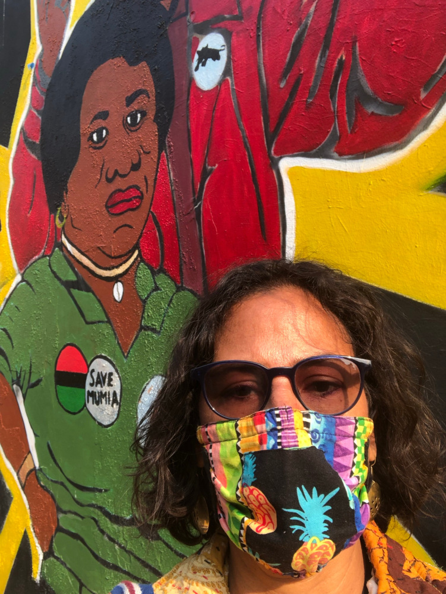
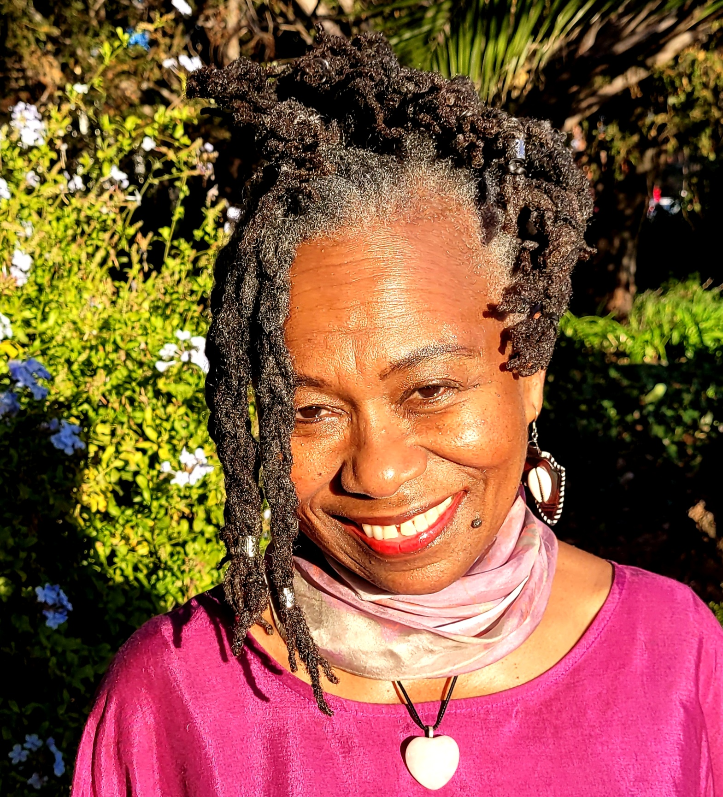
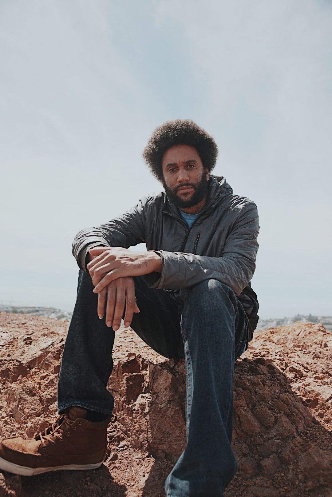
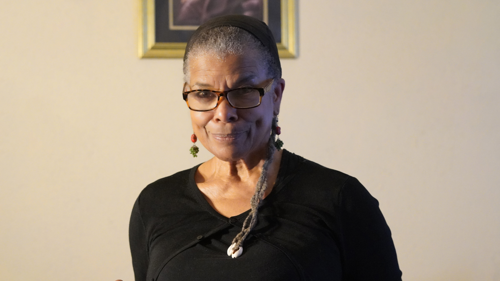
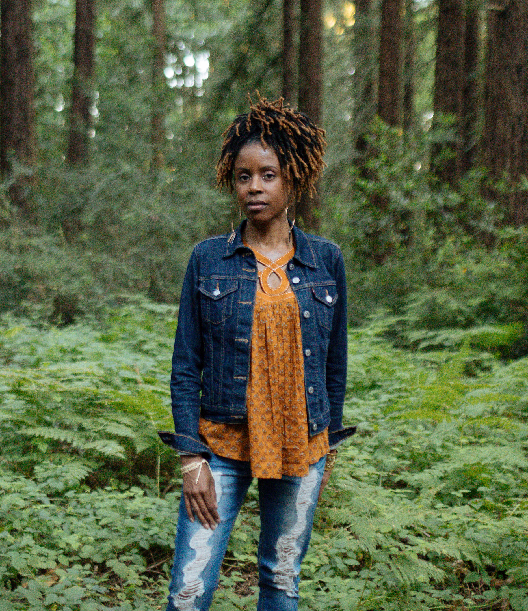
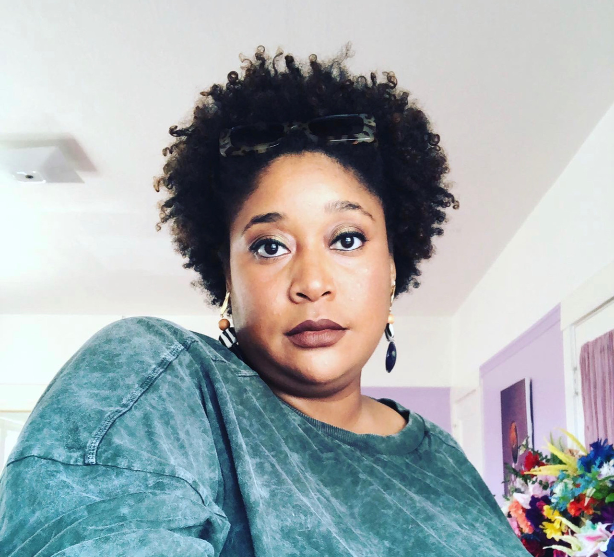
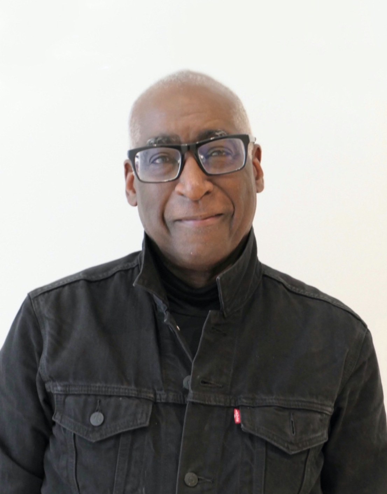

Title: National Black Poetry Day Celebration
Slug: 2022-black-poetry-day
date: 2022-10-17
Summary: The 2022 National Black Poetry Day Celebration featured the writers: San Francisco Poet Laureate Tongo Eisen-Martin, Dee Allen, Nana Boateng, Zakiyyah Capehart, Tureeda Mikell, Nia McAllister, adrienne danyelle oliver, Paige Prevost, Mimi Tempest, Michael Warr, and Kevin Dublin who also hosted.
video: aKyj-7l2oBo
Lang: en
template: article
header_cover: ../static/images/header-2022-black.jpg
cover: ../static/images/2022-black-poetry.jpg

<iframe width="560" height="315" src="https://www.youtube.com/embed/aKyj-7l2oBo" title="YouTube video player" frameborder="0" allow="accelerometer; autoplay; clipboard-write; encrypted-media; gyroscope; picture-in-picture; web-share" allowfullscreen></iframe>

Created in 1985, [Black Poetry Day](https://www.nationaldaystoday.com/black-poetry-day/) is celebrated every year on October 17 to honor all the talented African American poets, both past and present. Black Poetry Day is celebrated in commemoration of the birth of the man popularly referred to as the father of African American literature, [Jupiter Hammon](https://poets.org/poet/jupiter-hammon), the first published black poet in the United States of America. Born October 17, 1711, Hammon published his first poem called [“An Evening Thought: Salvation by Christ with Penitential Cries.”](https://www.poetryfoundation.org/poems/52545/an-evening-thought-salvation-by-christ-with-penetential-cries) in 1761.

Hosted by Kevin Dublin at the [Kimpton Alton Hotel](https://www.altonhotelsf.com/), the 2022 National Black Poetry Day Celebration features: Dee Allen, Nana Boateng, Zakiyyah Capehart, Tongo Eisen-Martin, Nia McAllister, Tureeda Mikell, adrienne danyelle oliver, Paige Prevost, Mimi Tempest, Michael Warr, and a special guest Zita Holbourne.

Dee Allen is an African-Italian performance poet based in Oakland, California. Active on creative writing & Spoken Word since the early 1990s. Author of 7 books--Boneyard, Unwritten Law, Stormwater, Skeletal Black (all from POOR Press), Elohi Unitsi (Conviction 2 Change Publishing) and his 2 newest, Rusty Gallows [Vagabond Books](https://www.vagabondbooks.net/2021/10/rusty-gallows.html) and Plans [Nomadic Press](https://nomadic-press.squarespace.com/store/plans)--and 61 anthology appearances under his figurative belt so far. Currently seeking a new publisher to transform his finished manuscript into a finished, printed 8th book.

Nana Boateng (she/her) is a Ghanaian-American poet, educator, and digital storyteller based in Oakland. She's dedicated to curating accessible spaces for people to connect, share, and archive their narratives digitally. In Nana’s spare time, she stitches together audio narratives about the African diaspora, bikes the Ohlone Greenway, and remedies writer's block through improv.

[**Karla Brundage**](https://www.karlabrundage.com/) is a Pushcart Prize nominee, Fulbright teacher and author of [*Swallowing Watermelons*](https://www.karlabrundage.com/shop/swallowing-watermelons) and her newest book [*Mulatta-Not so Tragic*](https://www.spdbooks.org/Products/9781737418405/mulatta--not-so-tragic.aspx), was just released and was co-authored with Allison Francis. She has performed her work onstage and online, both nationally and internationally. Her poetry, short stories and essays are in *Konch, Hip Mama, sPARKLE & bLINK, Bamboo Ridge Press, Vibe*.
 
 
[Zakiyyah G.E. Capehart](https://bookshop.org/p/books/ghana-on-my-mind-poetic-reflections-on-journeying-to-the-motherland-zakiyyah-g-e-capehart/16820117) is an author, poet, storyteller, performance artist, visual artist, radio producer and host. Her artistic skills combined with a medical and holistic background, allow her to help educate and heal the community. Zakiyyah's voice is heard on Full Circle on KPFA 94.1 FM in Berkeley, CA. Her poetry is published in numerous anthologies here and internationally. Zakiyyah's sojourn to Ghana inspired her to publish her first book, *Ghana On My Mind: Poetic Reflections on Journeying to the Motherland.*
 

[Kevin Dublin](https://kevindublin.com/) is an educator, economic justice advocate, and writer of poetry, prose, scripts, and code. Currently Director of Litquake’s Elder Writing Project, he’s committed to helping nurture emerging writers of all ages. He is the founder of The Living Room and author of *[How to Fall in Love in San Diego](https://www.finishinglinepress.com/product/how-to-fall-in-love-in-san-diego/)*, the forthcoming *Eulogy* (Raven & Wren Press, 2023), and finishing his first full-length collection. And for a little Black boy from Smithfield, NC, believes he has been brought a mighty long way.

Originally from San Francisco, [Tongo Eisen-Martin](https://www.instagram.com/_tongogara_/) is a poet, movement worker, and educator. His latest curriculum on extrajudicial killing of Black people, We Charge Genocide Again, has been used as an educational and organizing tool throughout the country. He is the author of [*Someone’s Dead Already*](https://www.spdbooks.org/Products/9780988610835/someones-dead-already.aspx), [Heaven Is All Goodbyes](https://citylights.com/poetry-published-by-city-lights/heaven-is-all-goodbyespocket-poets-61/), *Waiting Behind Tornados for Food*, and [Blood on the Fog](https://citylights.com/poetry-published-by-city-lights/blood-on-the-fog/). In 2020, he co-founded [Black Freighter Press](https://www.blackfreighterpress.com/) to publish revolutionary works. He is San Francisco’s eighth poet laureate.

<iframe width="560" height="315" src="https://www.youtube.com/embed/ONKjBGpF4z0" title="YouTube video player" frameborder="0" allow="accelerometer; autoplay; clipboard-write; encrypted-media; gyroscope; picture-in-picture; web-share" allowfullscreen></iframe>

 

[Nia McAllister](https://www.niamcallister.com/) is a Bay Area born poet, writer, and environmental justice advocate working at the intersection of art, activism, and public engagement. As Senior Public Programs Manager at the [Museum of the African Diaspora](https://www.moadsf.org/) in San Francisco, Nia creates participatory spaces for creative expression and literary dialogue. Nia’s writing and poetry have been featured on Poets of Color podcast and published in Radicle magazine, Meridians journal, and [Painting the Streets: Oakland Uprising in the Time of Rebellion](https://www.nomadicpress.org/store/p/paintingthestreets) (Nomadic Press, 2022).

[**Tureeda Mikell**](https://www.instagram.com/storymedicinewoman/?hl=en), Story Medicine Woman, is an award-winning poet whose work has been published in many languages. She was cited as an “Activist for Holism” by an Iranian doctorial scholar. She has published 73 anthologies of classroom writings authored by at-risk students. She is also a UC Bay Area Writing Project Fellow; the author of [*Synchronicity: The Oracle of Sun Medicine*](https://www.nomadicpress.org/store/p/synchronicity), nominated for the California Book Award; and the co-author/curator of EastSide Arts Alliance’s [*Patrice Lumumba Anthology*](https://www.nomadicpress.org/store/p/patricelumumba) (Nomadic Press). She was Oakland Museum Poet-in-Residence 2006 and was recently named 2022 Poet-in-Residence at the Museum of the African Diaspora.

<iframe width="560" height="315" src="https://www.youtube.com/embed/qxN3DQuh3DU" title="YouTube video player" frameborder="0" allow="accelerometer; autoplay; clipboard-write; encrypted-media; gyroscope; picture-in-picture; web-share" allowfullscreen></iframe>

 

[dr. adrienne danyelle oliver](https://www.adriennedanyelle.com) is a poet-educator, hip-hop scholar from Little Rock, AR currently living in the SF Bay Area. She enjoys writing about intergenerational healing. She has two chapbooks, [*collective madness*](https://www.finishinglinepress.com/product/collective-madness-by-adrienne-danyelle-oliver/) (Finishing Line Press) and [*the body has memories*](https://www.nomadicpress.org/store/p/thebodyhasmemories) (Nomadic Press) published, which include these reflections. Part poetry, part memoir, these chapbooks are the beginning of a liberation she hopes to witness among all bodies harboring historical trauma. Some of adrienne’s favorite authors include Maya Angelou and Toni Morrison. When she is not writing, adrienne leads healing writing circles for Black writers and curates [Black Gold Storytellers](https://blackgoldstorytellers.com/), an intergenerational storytelling circle featuring elders who have migrated from the South.

[**Paige Prevost**](https://wtpaige.net/) is a recent transplant to the Bay Area, moving here from Los Angeles, but was born and raised in Beaumont, TX #409. She loves slice of life, learning new things, contradictions, and imagining the worlds people live in. You can find her work in [Syzygy Magazine, Volume 2](https://www.blurb.com/b/11234101-syzygy-vol-2) among others. And eventually, yes, she will submit more poems.

[Mimi Tempestt](https://linktr.ee/mimitempestt) is a multidisciplinary artist, poet, and daughter of California. She has an MA in Literature from Mills College, and is currently a doctoral student in the Creative/Critical PhD in Literature at UC Santa Cruz. Her debut collection of poems, *The Monumental Misrememberings*, was published by Co-Conspirator Press in 2020.

[Michael Warr](https://michaelwarr-creativework.tumblr.com/) is the 2020 Berkeley Lifetime Achievement Awardee. His books include [*Of Poetry & Protest: From Emmett Till to Trayvon Martin*](https://wwnorton.com/books/9780393352733) (W.W. Norton), [*The Armageddon of Funk*](https://nupress.northwestern.edu/9781882688425/the-armageddon-of-funk/), [*We Are All The Black Boy*](https://bookshop.org/p/books/we-are-all-the-black-boy-michael-warr/12439843?ean=9780962428715), and *Power Lines: A Decade of Poetry From Chicago’s Guild Complex*. He is a San Francisco Library Laureate and recipient of a PEN Oakland Josephine Miles Award for Excellence in Literature, National Endowment for the Arts Fellowship and more.

<iframe width="560" height="315" src="https://www.youtube.com/embed/evqyABxZiPw" title="YouTube video player" frameborder="0" allow="accelerometer; autoplay; clipboard-write; encrypted-media; gyroscope; picture-in-picture; web-share" allowfullscreen></iframe>

[Zita Holbourne](http://www.zitaholbourne.com/), author of [*Striving For Equality Freedom and Justice*](https://www.etsy.com/uk/listing/400061505/book-striving-for-equality-freedom) is an award-winning, trade union, community & human rights campaigner and activist, visual artist, curator, poet, writer and vocalist. She studied art & graphic design at the London College of Printing and Watford School of Art. Zita has over 30 years of experience working in the arts including as a graphic designer, illustrator & make-up artist and exhibits at a range of cultural, community & political events. Outside of her creative pursuits, Zita has worked in employment law and rights, industrial relations and has been a senior trade activist for 25 years and counting. Zita has curated political and cultural art exhibitions to challenge racism, wider discrimination, injustice and to promote equality, justice, rights and freedom.
