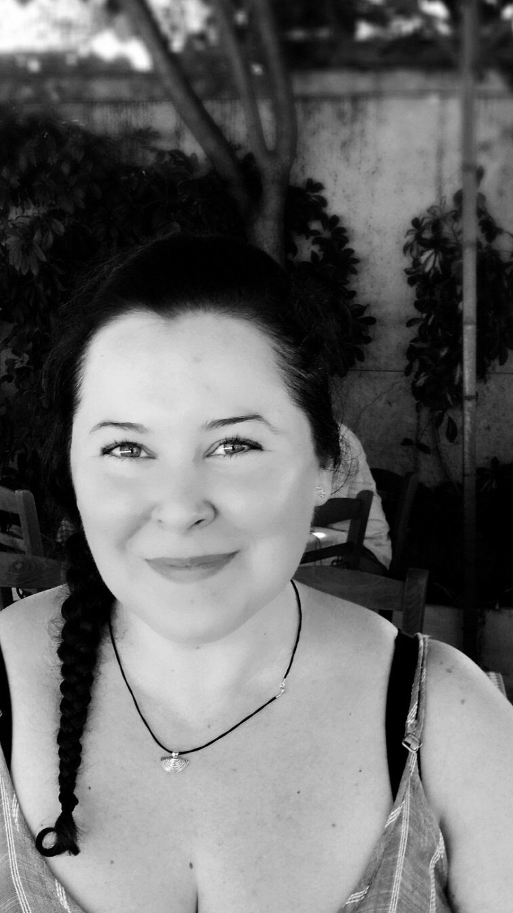
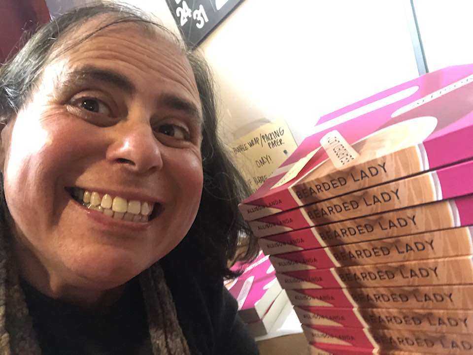
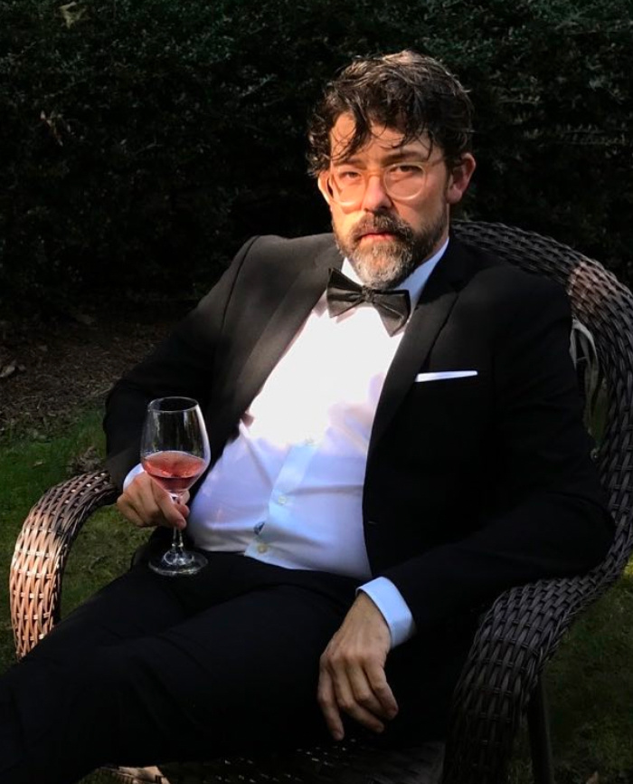

Title: October Show: Tricks
Slug: 2022-october
date: 2022-10-28
Summary: The October 2022 show theme is *Tricks* and the featured writers are: Katie Aliféris, Allison Landa, Aiya Madarang, Noah Sanders, and Meri Tumanyan.
video: jxjx8CAMHXw
Lang: en
template: article
header_cover: ../static/images/header-tricks.png
cover: ../static/images/10-28-show.png

<iframe width="560" height="315" src="https://www.youtube.com/embed/jxjx8CAMHXw" title="YouTube video player" frameborder="0" allow="accelerometer; autoplay; clipboard-write; encrypted-media; gyroscope; picture-in-picture" allowfullscreen></iframe>

Hosted by Kevin Dublin and Giovanna Lomanto, the theme is "Tricks" and the featured writers are: Katie Aliféris, Allison Landa, Aiya Madarang, Noah Sanders, and Meri Tumanyan.

[**Katie Aliféris**](https://katiealiferis.com/) is a poet from San Francisco. She has been a featured performer at 40 local and international literary series and events including LitCrawl, The Melbourne Fringe Festival, and North Beach First Fridays at City Lights Books. Her first book, [*fool[ishly optimistic]*](https://www.nomadicpress.org/store/p/foolishlyoptimistic), was published by Nomadic Press in February of 2022.

[**Allison Landa**](http://www.allisonlanda.com/) is a Berkeley-based writer, editor, and coach whose memoir *Bearded Lady* came out from [Woodhall Press](https://www.woodhallpress.com/product-page/bearded-lady/) in October 2022. She earned her MFA in creative writing from St. Mary's College of California and is represented by Marisa Zeppieri of Strachan Literary Agency. 

[**Aiya Madarang**](https://www.instagram.com/aiyuhkatreenuh/) is a creative writer and a proud member of [Syzygy art collective](https://www.syzygysf.com/). Her work has been published in *Forum, Rise Up Review*, *The Abstract Elephant*, [*Syzygy Magazine*](https://www.blurb.com/b/11234101-syzygy-vol-2), and presented in art exhibits at Syzygy and Southern Exposure. Ask her about her favorite lines of prose.

[**Noah Sanders**](https://twitter.com/sandersnoah/) is the founder, editor and curator of [*The Racket*](https://www.theracketreadingseries.com/) and all it's tiny, tiny moving parts. He recently had a dream about a wormhole full of tentacles and woke with both his legs in the air.

[**Meri Tumanyan**](https://meritumanyanbooks.com/) was born in Armenia, raised in the United States, and currently resides in California. She received a B.A. in Comparative Literary Studies from Occidental College and an M.A. in Creative Writing from California State University Northridge. She is a mother, a full-time high school teacher, and an adjunct English professor. Meri is the author of a poetry collection *Love in the Time of Corona*, as well as the children’s books *Mommy, the Dreamweaver*, *Daddy’s Waltz*, and *Never Be Anyone Other Than You*. Her collection of poems celebrates the power of unconditional, all-encompassing love as a healing force. Poetry becomes an exploration of the truth, a need to reconcile the disappointments experienced with acceptance and endurance, patiently hoping for a stronger, more loving, more evolved self to emerge.

