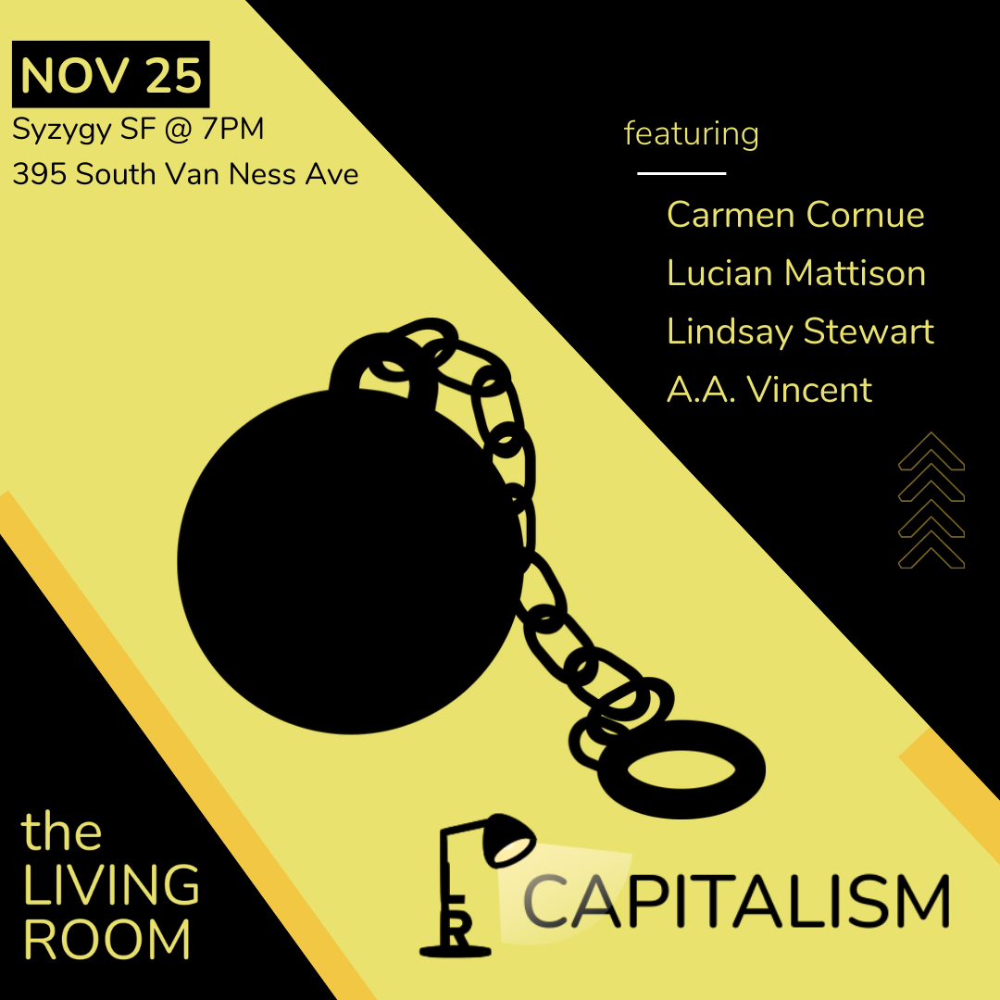
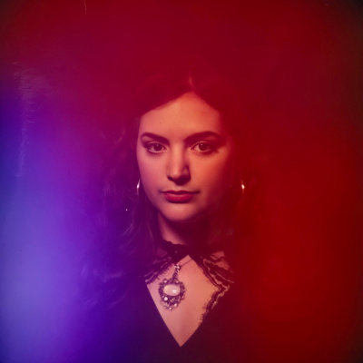
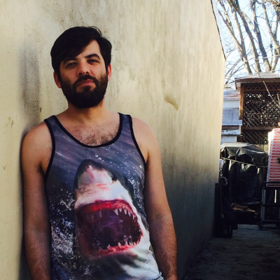
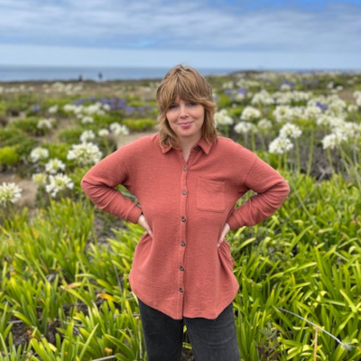

Title: November Show: Capitalism
Slug: 2022-november
date: 2022-11-25
Summary: The November 2022 show theme is *Capitalism* and the featured writers are: Carmen Cornue, Lucian Mattison, Lindsay Stewart, and A.A. Vincent.
video: placeholder
Lang: en
template: article
header_cover: ../static/images/header-capitalism.png
cover: ../static/images/11-22-show.png

<iframe width="560" height="315" src="https://www.youtube.com/embed/plaeholder" title="YouTube video player" frameborder="0" allow="accelerometer; autoplay; clipboard-write; encrypted-media; gyroscope; picture-in-picture" allowfullscreen></iframe>

Hosted by Kevin Dublin the theme is "Capitalism" and the featured writers are: Carmen Cornue, Lucian Mattison, Lindsay Stewart, and A.A. Vincent.

[**Carmen Cornue**](http://box5656.temp.domains/~carmenf8/) is a writer living in San Francisco. Her writing has appeared in *Southword*, *The Atlanta Review*, *Apricity Press*, Dutch Kills Press, Mad Gleam Press and on the podcast, “Beyond the Screams”. For her work, she was selected to participate in the City of San Francisco’s Guaranteed Income for Artists program, powered by YBCA. She co-founded the literary collective Spleen with Donna Morton in 2015 to create and champion radical documents of desire written by queer women.

[**Lucian Mattison**](https://www.lucianmattison.com/) is a poet based in the Bay and a soon to be an Oaklander. His latest collection, [*Curare*](https://www.crpress.org/shop/curare/), won the 2021 C&R Press Poetry Award and was just released in October. He is a fan of the ocean, any and all sharks, gardening, hot peppers, cooking, 8-ball, and backgammon. 

[**Lindsay Stewart**](https://lindsaystewart.weebly.com/) is from Glen Ellen, California. Her work has been featured in *The Los Angeles Review*, *Tar River Poetry*, *Spillway*, and *The Shore*, and one of her poems was featured on an episode of the Poetry Foundation’s *VS podcast*. Her chapbook *house(hold)* is coming out this winter from Eggtooth Editions.

[**A.A. Vincent**](https://aavincent.net/) is a poet and essayist. Their full length poetry collection Person, Perceived Girl published by Barrow Street Press, came out October 2022. Their poems have appeared in places such as Quiet Lightning, Santa Clara Review, West Trestle Review, Write Now! SF Bay, *Essential Truths: The Bay Area In Color*, and Black Bird Press News & Review.Their essays have been published in places such as SF Weekly, Poetry Foundation, and In These Times. They live in the Bay Area. 

