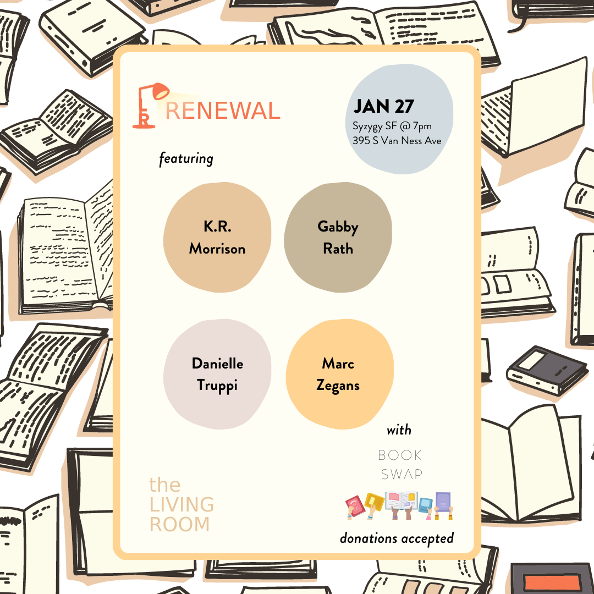
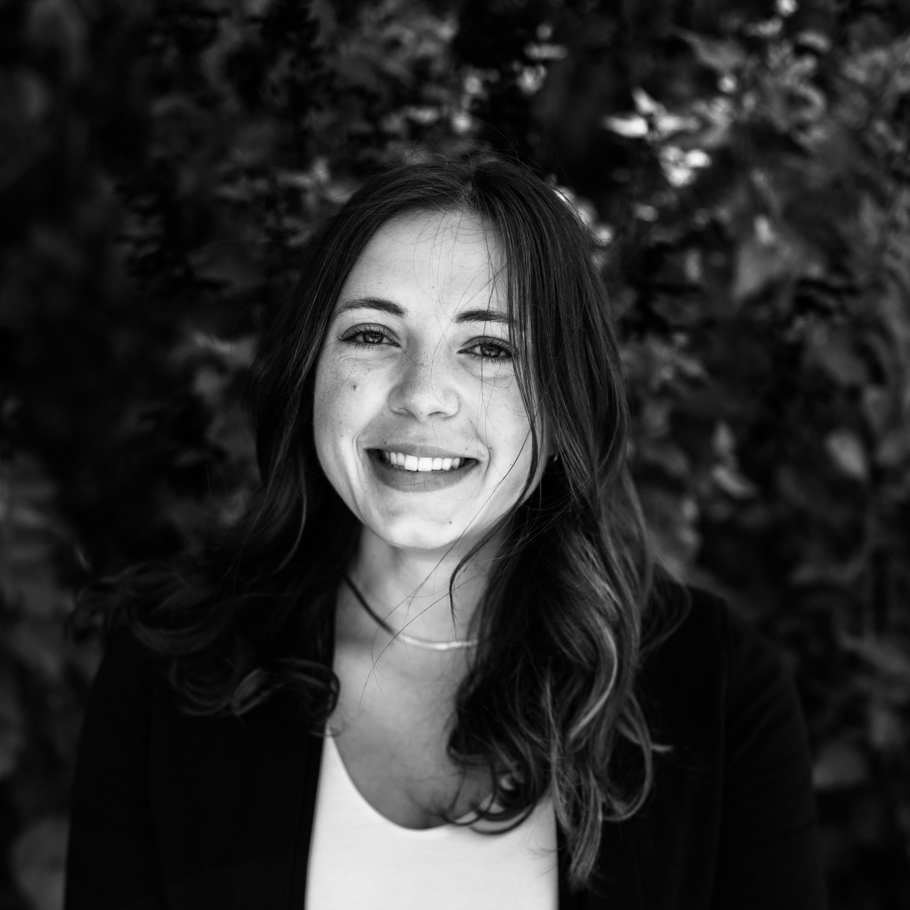
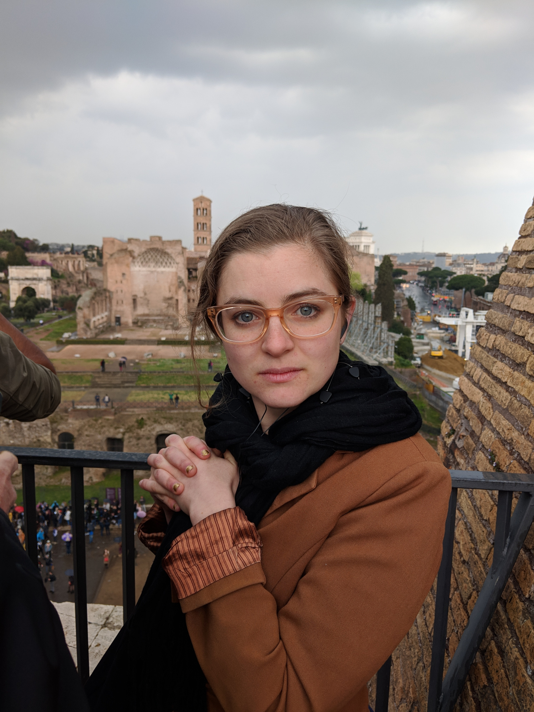
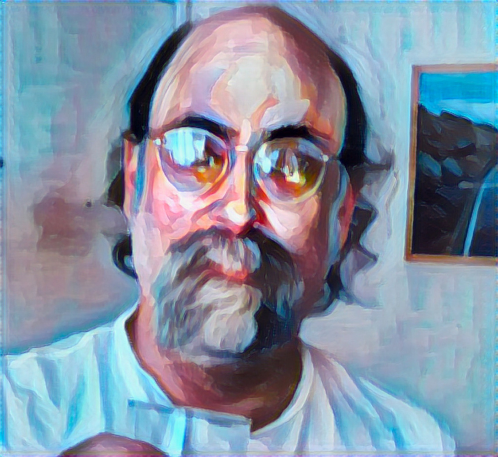

Title: January Show: Renewal
Slug: 2023-January
date: 2023-1-27
Summary: The January 2023 show theme is *Renewal* and the featured writers are: K.R. Morrison, Gabby Rath, Danielle Truppi, Marc Zegans.
video: ibIS12bvVnY
Lang: en
template: article
header_cover: ../static/images/23-jan-show.jpg

<iframe width="560" height="315" src="https://www.youtube.com/embed/8X3JUxWxnjc" title="YouTube video player" frameborder="0" allow="accelerometer; autoplay; clipboard-write; encrypted-media; gyroscope; picture-in-picture" allowfullscreen></iframe>

Hosted by Kevin Dublin & Giovanna Lomanto, the January 2023 show theme is "Renewal" and the featured writers are: K.R. Morrison, Gabby Rath, Danielle Truppi, and Marc Zegans.

[**K.R. Morrison**](https://www.instagram.com/k.r.morrisonpoet/) splits her time between San Francisco and a place she calls Mermaid Town in Southern California. Besides being a poet, she is a moon witch, a drummer in three bands, and a high school teacher who has been teaching English and Creative Writing for 18 years. Her first chapbook *Cauldrons* was published by Paper Press Books. Morrison has featured for various podcasts and curations, and she is a Pushcart nominee for her poem, “Her Altar.” Morrison's work can be found in several publications, most recently the *Beat not Beat Anthology*, published by MoonTide Press.

[** Gabby Rath**](https://www.instagram.com/thegabsofrath/) is a poet based in San Francisco. Drawn from her intuitively observant nature, Gabby is able to illuminate emotion and crystallize our collective connection through her work of writing about life’s liminal moments. She will be self-publishing her first poetry book, *Back of My Mind*, this upcoming spring.

[**Danielle Truppi**](https://www.danielletruppi.com/) is a co-host and producer of the reading series [Happy Endings](https://www.facebook.com/happyendingsreading/). She holds an MFA in fiction from San Francisco State University and is back in school to become a librarian.

[**Marc Zegans**](http://www.marczegans.com/) has penned seven collections of poems, most recently, *Lyon Street* (Bamboo Dart Press, 2022), *The Snow Dead* (Cervena Barva Press, 2020), and *Swizzle Felt’s First Folio from the Typewriter Underground* (Pelekinesis, 2019); two spoken word albums, several immersive theatrical productions, including *Sirens, Dreams and a Cat* (co-written with D. Lowell Wilder, 2020), and many short films. He lives by the coast in Northern California.

