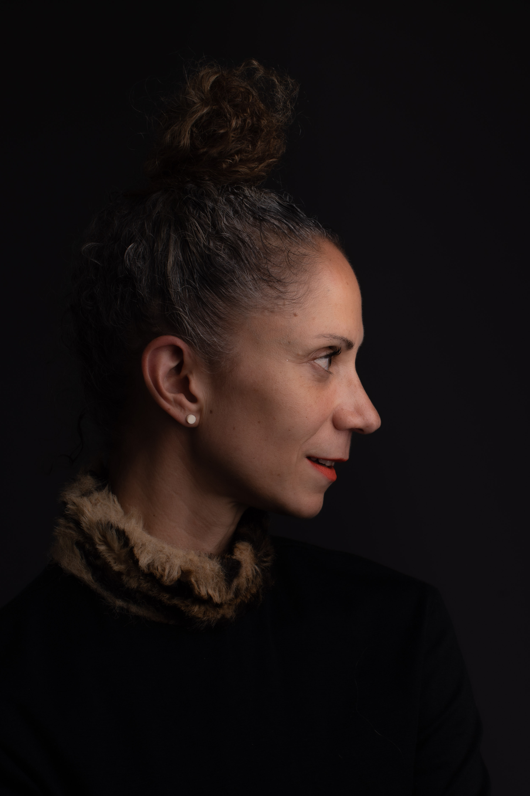
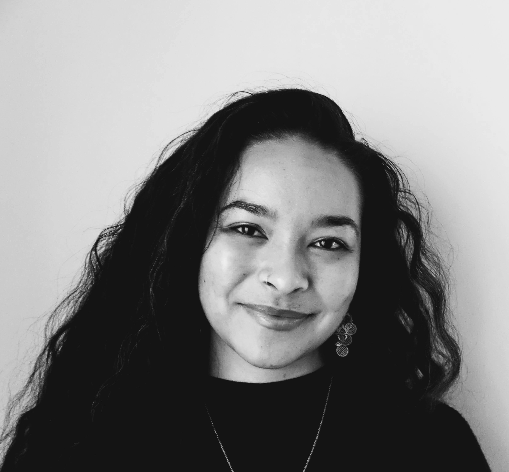

Title: February Show: Excellence
Slug: 2023-february
date: 2023-2-24
Summary: The February 2023 show theme is *Excellence* and the featured writers are: Donté Clark, Maurya Kerr, Nia McAllister, and Darius Simpson.
video: aF4zhNxClZw
Lang: en
template: article
header_cover: ../static/images/23-feb-show.png

<iframe width="560" height="315" src="https://www.youtube.com/embed/uJDn7KqYPfc" title="YouTube video player" frameborder="0" allow="accelerometer; autoplay; clipboard-write; encrypted-media; gyroscope; picture-in-picture; web-share" allowfullscreen></iframe>

Hosted by Kevin Dublin & Giovanna Lomanto, the February 2023 show theme is "Excellence" and the featured writers are: Donté Clark, Maurya Kerr, Nia McAllister, and Darius Simpson. *Erin Mansur was unable to appear and will join at a later date.

[**Donté Clark**](https://fmpublishing.us/products/psalms) is a student of rhythm and poetry, turning pain to power drawing purpose from prophecy.

[**Maurya Kerr**](https://www.tinypistol.com/) is a bay area-based writer, educator, and artist. Maurya's poetry has been nominated for a Pushcart prize and appears in multiple journals, including *Magma Poetry, Poet Lore, Southern Humanities Review*, and an anthology, *The Future of Black: Afrofuturism, Black Comics, and Superhero Poetry*. Much of her artistic work, across disciplines, is focused on black and brown people reclaiming their birthright to both wonderment and the quotidian. Maurya was a 2021/22 UC Berkeley ARC (Arts Research Center) Poetry & the Senses Fellow, and her first chapbook, *MUTTOLOGY*, will be published with Harbor Editions in 2023. 

[**Nia McAllister**](https://www.niamcallister.com/) is a Bay Area born poet, writer, and environmental justice advocate working at the intersection of art, activism, and public engagement. As Senior Public Programs Manager at The Museum of the African Diaspora (MoAD)](https://www.moadsf.org/programs-events) in San Francisco, Nia creates participatory spaces for creative expression and literary dialogue. Nia's writing and poetry have been featured on [Poets of Color Podcast](https://www.podchaser.com/podcasts/poets-of-color-podcast-678431/episodes/poets-of-color-podcast-episode-42844306) and published in *Doek! Literary Magazine, Radicle magazine, Meridians journal*, and *Painting the Streets: Oakland Uprising in the Time of Rebellion* (Nomadic Press, 2022).

[**Darius Simpson**](https://dariussimpson.com/) is a writer, educator, performer, and skilled living room dancer from Akron, Ohio. Much like the means of production, he believes poetry belongs to and with the masses. He aims to inspire those chills that make you frown and slightly twist up ya face in approval. Darius believes in the dissolution of empire and the total liberation of Africans and all oppressed people by any means available. Free All Political Prisoners. Free The People. Free The Land.
