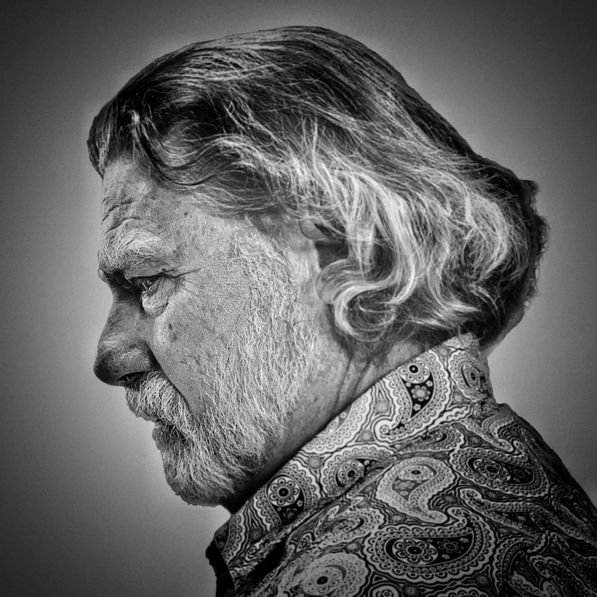
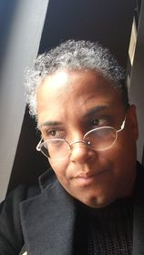
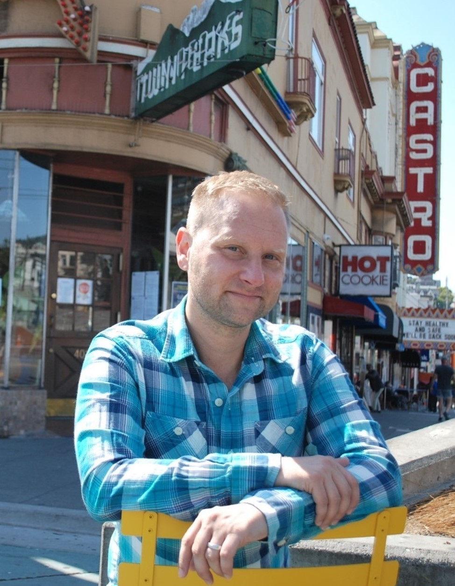
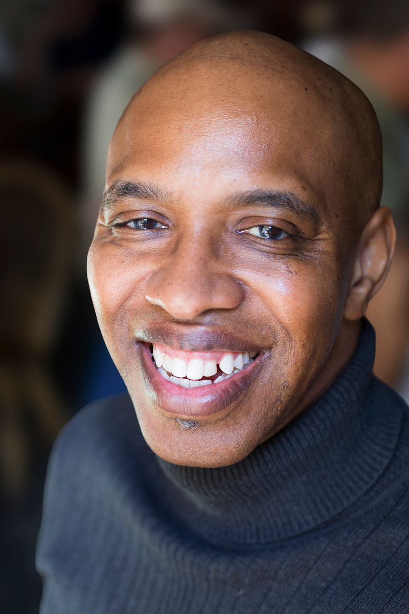

Title: March Show: Education
Slug: 2023-march
date: 2023-3-24
Summary: The March 2023 show theme is *Education* and the featured writers are: Fred Dodsworth, Erin Mansur, James J. Siegel, and André Le Mont Wilson.
video: mfuz2Yix47Q
Lang: en
template: article
header_cover: ../static/images/23-mar-show.jpg

<iframe width="560" height="315" src="https://www.youtube.com/embed/mfuz2Yix47Q" title="YouTube video player" frameborder="0" allow="accelerometer; autoplay; clipboard-write; encrypted-media; gyroscope; picture-in-picture; web-share" allowfullscreen></iframe>

Hosted by Kevin Dublin & Kate Dublin, the March 2023 show theme is "Education" and the featured writers are: Fred Dodsworth, Erin Mansur, James J. Siegel, and André Le Mont Wilson.

[**Fred Dodsworth**](https://DodsworthBooks.com) is a poet, a host of poetry events, a designer of poetry books, and a publisher of poetry books. He is all this and more. 

<iframe width="560" height="315" src="https://www.youtube.com/embed/HA8sQRjFHao" title="YouTube video player" frameborder="0" allow="accelerometer; autoplay; clipboard-write; encrypted-media; gyroscope; picture-in-picture; web-share" allowfullscreen></iframe>

**Erin Mansur** is an educator with over twenty years of experience working with students from pre-school to graduate levels. Born in New England, she never spent more than two years in any one place until she moved to New York six weeks after 9/11. She now considers Brooklyn her hometown. In addition to being a teacher, Erin is also an advocate fir several marginalized and under-represented communities including the homeless, LGBTQA+ youth, people in recovery and the disabled. Erin is also proudly Deaf. 

<iframe width="560" height="315" src="https://www.youtube.com/embed/idTBH-fV3SA" title="YouTube video player" frameborder="0" allow="accelerometer; autoplay; clipboard-write; encrypted-media; gyroscope; picture-in-picture; web-share" allowfullscreen></iframe>

[**James J. Siegel**](https://jamesjsiegel.com/) is a Pushcart-nominated poet and author of the poetry collections [*The God of San Francisco*](https://siblingrivalrypress.bigcartel.com/product/the-god-of-san-francisco-by-james-j-siegel) (Sibling Rivalry Press) and [*How Ghosts Travel*](https://www.spuytenduyvil.net/how-ghosts-travel.html), which was a finalist for an Ohioana Library Award. He is also the host and curator of the monthly [Literary Speakeasy](https://www.facebook.com/LiterarySpeakeasy/) show at Martuni’s piano bar in San Francisco. His poems have been featured in the *Cortland Review, Borderlands: Texas Poetry Review, HIV Here & Now, Foglifter*, and many more.

<iframe width="560" height="315" src="https://www.youtube.com/embed/aPeKdcmpItc" title="YouTube video player" frameborder="0" allow="accelerometer; autoplay; clipboard-write; encrypted-media; gyroscope; picture-in-picture; web-share" allowfullscreen></iframe>

[**André Le Mont Wilson**](https://www.facebook.com/andrewilsonstoryteller) is a Black queer writer who won the 2022 Newfound Prose Prize for his essay chapbook, [*Hauntings*](https://newfound.org/shop/andre-le-mont-wilson-hauntings-print-e-book-copy/), a collection of published essays exploring the intersectionality between lynching and the Black Lives Matter movement. His work has appeared in *Sun Magazine, Litro Magazine, RFD Magazine, Sparkle & Blink*, and *Obsidian: Literature & Arts in the African Diaspora*. He teaches storytelling to adults with disabilities in Oakland.

<iframe width="560" height="315" src="https://www.youtube.com/embed/IjHnZ8M2Y9A" title="YouTube video player" frameborder="0" allow="accelerometer; autoplay; clipboard-write; encrypted-media; gyroscope; picture-in-picture; web-share" allowfullscreen></iframe>

