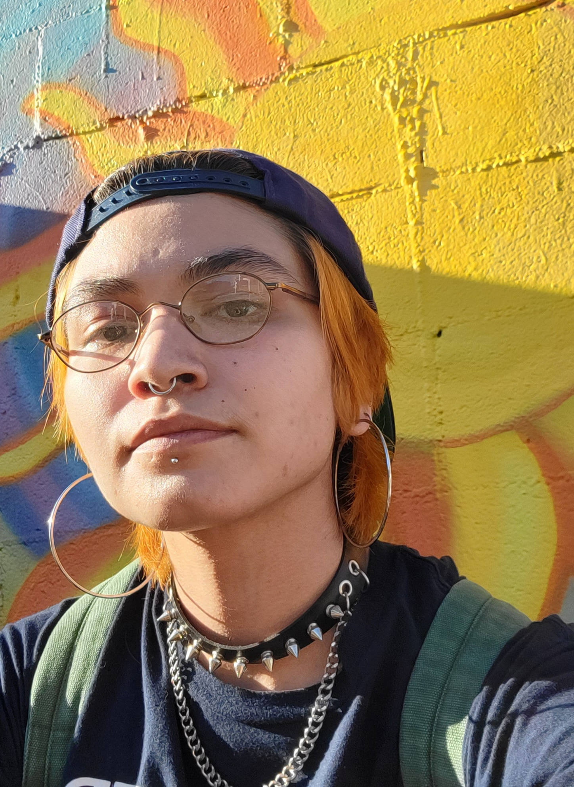
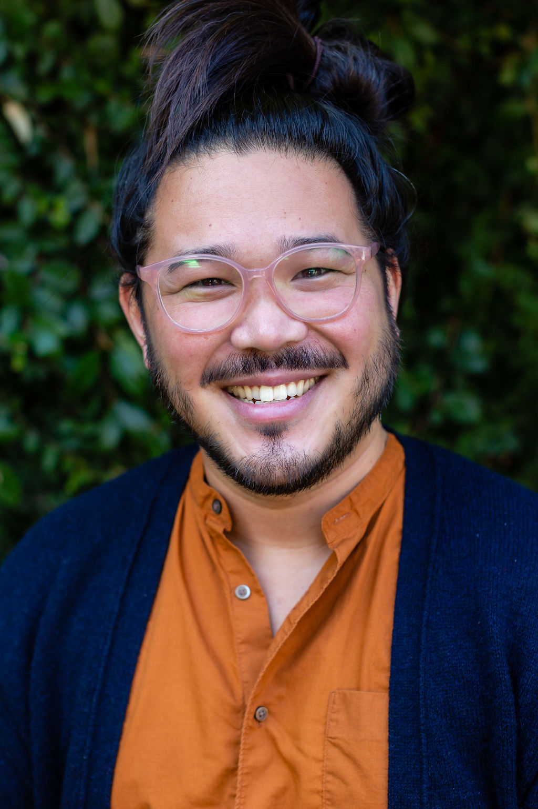
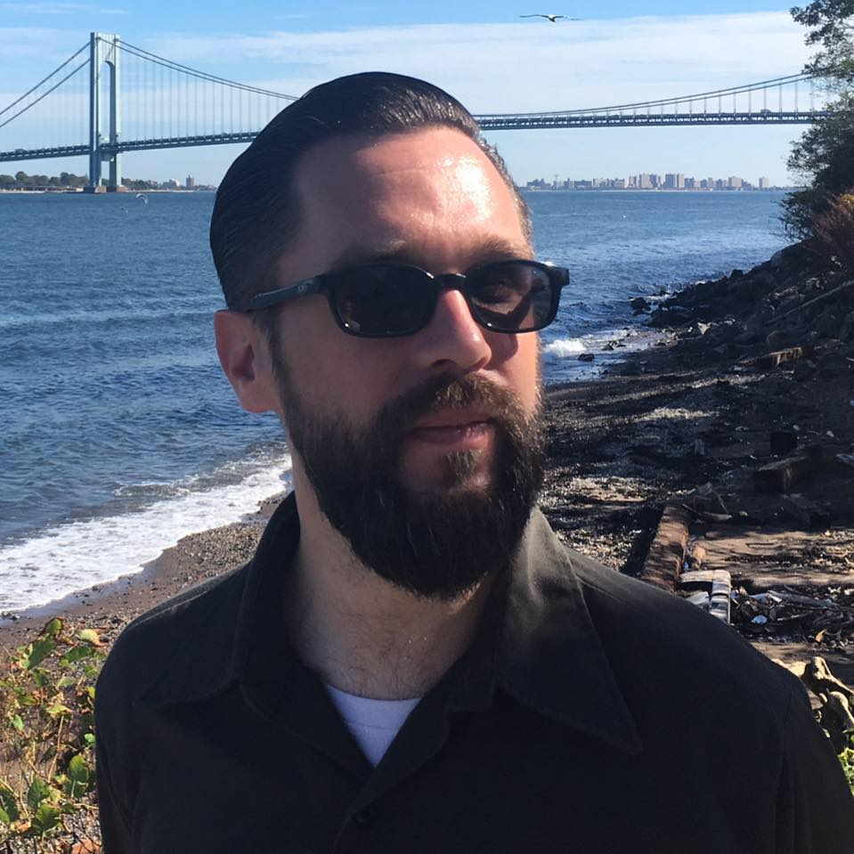
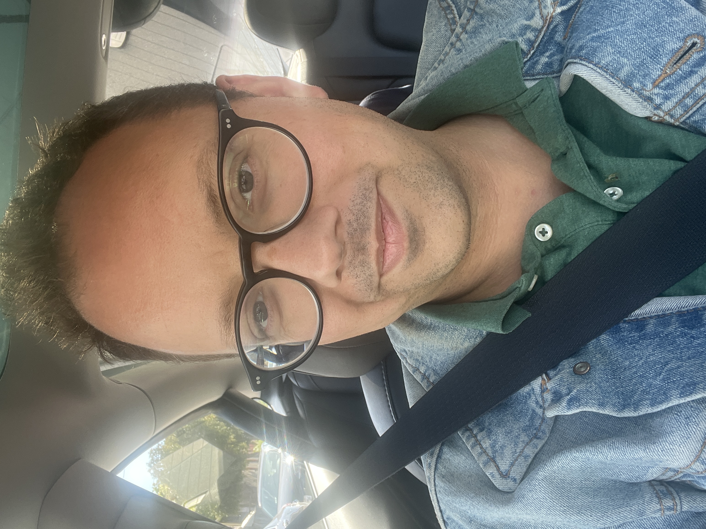

Title: April Show: Cruelty
Slug: 2023-april
date: 2023-4-28
Summary: The April 2023 show theme is *Cruelty* and the featured writers are: Soledad con carne, Dan Lau, J. Brandon Loberg, Elizeya Quate, & Arisa White.
video: ZbajKCKwBmY
Lang: en
template: article
header_cover: ../static/images/23-apr-show-header.jpg

<iframe width="560" height="315" src="https://www.youtube.com/embed/p6LBmsrCkl8" title="YouTube video player" frameborder="0" allow="accelerometer; autoplay; clipboard-write; encrypted-media; gyroscope; picture-in-picture; web-share" allowfullscreen></iframe>

Hosted by Kevin Dublin & Kate Dublin, the April 2023 show theme is "Cruelty" and the featured writers are: Soledad con carne, Dan Lau, J. Brandon Loberg, Elizeya Quate, & Arisa White.

[**Soledad con carne**](https://www.instagram.com/soledadconcarne/) is known as the poet laureate of the San Fernando Valley. They are a first-gen Chicanx poet, mixed media artist, and co-editor of Acid Verse. Soledad is currently based on Ohlone land.

[**Dan Lau**](https://danplau.me/) is a Chinese American poet raised on Munsee Lenape land also known as Queens, New York. A [Kundiman fellow](https://www.kundiman.org/), he is the recipient of scholarships, grants, and residencies from The Fine Arts Work Center at Provincetown, Queer Cultural Center, San Francisco Arts Commission, Willapa Bay AiR, and Caldera. His poems have been published in *Generations, Cape Cod Review, Gesture, RHINO, CRATE, Colorado Review, Tinderbox Poetry Journal* and others. He is the former Managing Poetry Editor of [*Foglifter*](https://foglifterjournal.com/about-foglifter/), a queer journal and press. Currently, he is the Individual Giving Manager at East Bay Community Law Center.

[**J. Brandon Loberg**](https://sf.funcheap.com/16th-mission-open-mic-w-out-a-mic-90/) indulges heavily in book and poster design and typography, has served as co-editor of the *16th & Mission Review*, organized seven7h tangent, a collective of volunteer artists and writers, which published several books from writers in the Mission literary community. Loberg also works for The Beat Museum and has served as Quiet Lightning’s designer. Catch him on the corner of 16th & Mission after 9pm on Thursdays taking in the street poetry of others and giving it back.

[**Elizeya Quate**](http://www.elizeyaquate.com/) is a poet, performer in SF whose work has appeared in *Sparkle & Blink, Joyland, Big Lucks, The Huffington Post*, and whose chapbook *cra-que-lure* was published by Finishing Line Press.

[**Arisa White**](https://arisawhite.com/) is an associate professor of English and Creative Writing at Colby College. Most recently, she is the author of *Who’s Your Daddy*, co-editor of *Home Is Where You Queer Your Heart*, and co-author of *Biddy Mason Speaks Up*, the second book in the *Fighting for Justice Series* for young readers. Her poetry is widely published and her collections have been nominated for an NAACP Image Award, Lambda Literary Award, and have won the Per Diem Poetry Prize, Maine Literary Award, Nautilus Book Award, an Independent Publisher Book Award, and Golden Crown Literary Award.  As the creator of the Beautiful Things Project, Arisa curates poetic collaborations that are rooted in Black queer women’s ways of knowing. She is a Cave Canem fellow and serves on the board of directors for Foglifter Press, as well as the Community Advisory Board for Maine Writers & Publishers Alliance. Currently, in development with composer Jessica Jones, Arisa is working on *Post Pardon: The Opera*.
