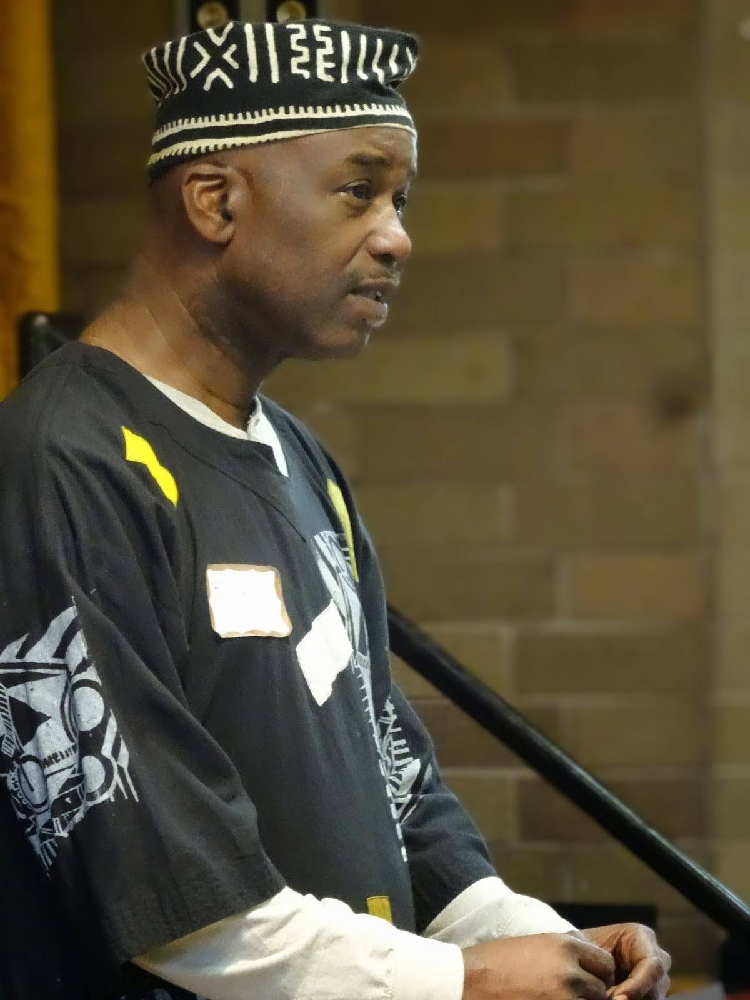

Title: May Show: Travel
Slug: 2023-may
date: 2023-5-26
Summary: The May 2023 show theme is *Travel* and the featured writers are: Jack Boulware, Zakiyyah G.E. Capehart-Bolling, and Julian Mithra with the special guest musical stylings of Bryant Bolling as a part of The TuBeNu Cultural Gatherers.
video: 2TGjj4L3m8c
Lang: en
template: article
header_cover: ../static/images/23-may-show-header.jpg

<iframe width="560" height="315" src="https://www.youtube.com/embed/RLP4ECnHQF8" title="YouTube video player" frameborder="0" allow="accelerometer; autoplay; clipboard-write; encrypted-media; gyroscope; picture-in-picture; web-share" allowfullscreen></iframe>

Hosted by Kevin Dublin & Giovanna Lomanto, the May 2023 show theme is "Travel" and the featured writers are: Jack Boulware, Zakiyyah G.E. Capehart-Bolling, and Julian Mithra with the special guest musical stylings of Bryant Bolling as a part of The TuBeNu Cultural Gatherers.

[**Jack Boulware**](https://jackboulware.com/) is co-founder and Executive Director of [Litquake](https://litquake.org/), now in its 24th year as San Francisco's Literary Festival. He is author/co-author of three nonfiction books, including the Bay Area punk oral history Gimme Something Better. As a journalist he has covered stories in 20 countries. He grew up in rural Montana, and attended a one-room schoolhouse which is no longer there.

 
[**Zakiyyah G.E. Capehart-Bolling**](https://bookshop.org/p/books/ghana-on-my-mind-poetic-reflections-on-journeying-to-the-motherland-zakiyyah-g-e-capehart/16820117) is an author, poet, storyteller, performance artist, visual artist, radio producer and host. Her artistic skills combined with a medical and holistic background, allow her to help educate and heal the community. Zakiyyah's voice is heard on Full Circle on KPFA 94.1 FM in Berkeley, CA. Her poetry is published in numerous anthologies here and internationally. Zakiyyah's sojourn to Ghana inspired her to publish her first book, *Ghana On My Mind: Poetic Reflections on Journeying to the Motherland.*

[**Bryant B. Bolling**](https://www.youtube.com/@mrbthesingingbard7306) has a Masters of Art in Musicology and a Bachelor of Science degree in Music Education from Morgan State University in Baltimore, MD. Bolling is the founder and band leader of the Bryant Bolling Quartet. He has received a Fullbright-Hayes Scholarship to study and travel throughout Kenya and Tanzania, East Africa as well as several grants from the Akonadi Foundation to create programs that address social conditions in the Oakland communities, "Love Will Find A Way" and "Stop The Violence." Numerous publications have been written on Bolling's musical career. He continues to lecture and [perform nationally and abroad](https://www.facebook.com/mrbthesingingbard/).

[**Julian Mithra**](https://julianmithra.weebly.com/#/) hovers between genders and genres, border-mongering and -mongreling. Winner of the 2023 Alcove Chapbook Prize, *Promiscuous Ruin* (WTAW, 2023) twists through labyrinthine deer stalks in the imperiled wilderness of inhibited desire. *Unearthingly* (KERNPUNKT, 2022) excavates forgotten spaces to mine the occult for queer solidarity. 
