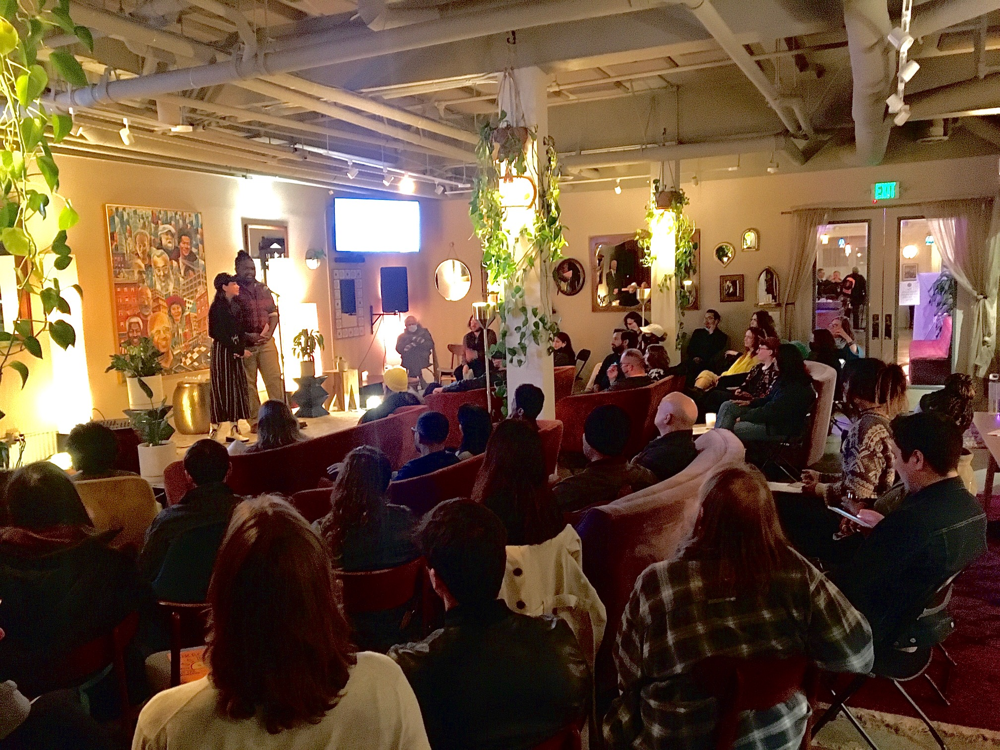
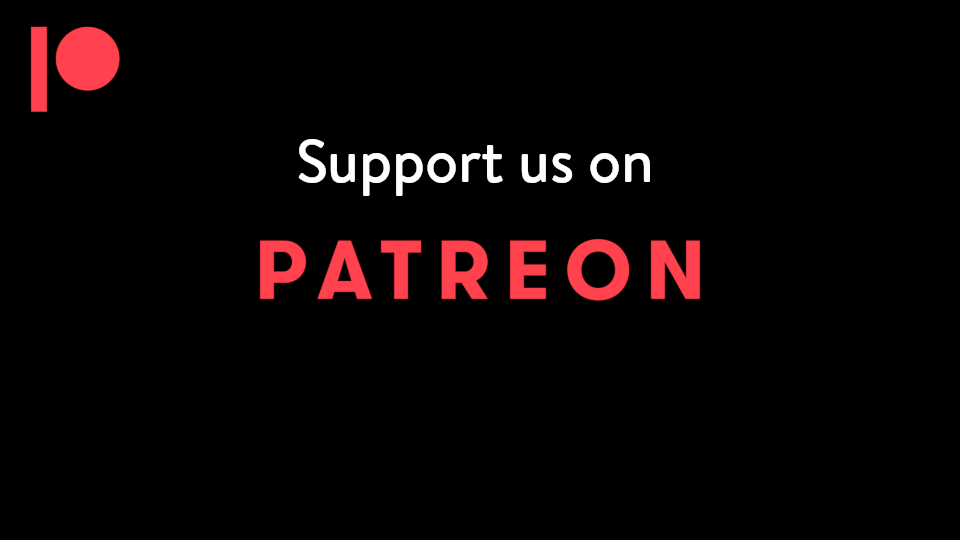

Title: The Living Room
Slug: about
Summary: About the Living Room Reading Series & Salon.
header_cover: ../static/images/about-header.png

About the Series

Join us in the living room at Syzygy on the Fourth Friday of each month for intimate poetry performances, ideas, and conversation. Based in the Mission district of San Francisco, Each 90 minute event has a theme, set of at least five poets, 15 minute intermission of open discussion about a question that affects Bay Area residents or the world at-large, and a [community partner](https://thelivingroomsf.com/partners/) who uplifts vulnerable populations that we spotlight to help raise awareness and solicit donations of funds or time for the cause.

You can see previous themes on the [homepage](https://thelivingroomsf.com/). Some upcoming themes include: Enviornment, Tricks, Capatilism, Extinction, and Renewal.

Most events will have the structure:

- 2 minutes introduction to theme
- 3 minutes word from community partner
- 15-20 minutes first set of readers
- 15 minutes open discussion of theme among audience, community partner shoutout
- 10-15 minutes second set of readers
- 2 minute in closing and final community partner shoutout

If you had to sum up the spirt of the show in a poem, it might come closest with "The Guest House" by Jalāl ad-Dīn Mohammad Rūmī, the 13th century Persian poet who reminds us to welcome, be grateful for the full range of human emotion and experience because of what it might lead to, and to be empathetic to others who may be experiencing a guest different than your own at the moment:

---

<strong>The Guest House | Rumi</strong>, <em>translation by Coleman Barks</em>

This being human is a guest house. 
Every morning a new arrival. 
 
A joy, a depression, a meanness, 
some momentary awareness comes 
as an unexpected visitor. 
 
Welcome and entertain them all! 
Even if they are a crowd of sorrows, 
who violently sweep your house 
empty of its furniture, 
still, treat each guest honorably. 
He may be clearing you out 
for some new delight. 
 
The dark thought, the shame, the malice. 
meet them at the door laughing and invite them in. 
 
Be grateful for whatever comes. 
because each has been sent 
as a guide from beyond. 
 

---

The Living Room is but one part of a larger vision to develop an incubator and community-building program for writers with the intent to make being a full-time writer accessible to anyone and not a privilege. *Said another way,* the idea is to dismantle the idea of the full-time writer as a solitary and privileged individual with graduate education and a professorship to sustain their writing. Instead, a full-time writer is a community-uplifting, politically-engaged, financially supported culture bearer who crafts their work, publishes & performs it, is a part of contributing their creative & technical skills to build communities connected to their own passions while also being able to afford housing, dining, and other bills as well as radical self-care like massages and travel. The Living Room serves to help writers develop the necessary skills and to be a conduit for connecting writers into established communities through partnerships and its own programming in scholarship-funded workshops (education), reading series & salons (community & political advocacy), youth mentoring and support through creative writing activities (youth outreach), elder support and capturing of stories from seniors in their own voices while also helping to combat isolation with creativity (senior outreach), support in building all of these writers' careers through a community press and advising for finding and applying to grants and residencies (publishing and advocacy), and getting writers into non-traditional spaces such as business lunch hours (service-learning & corporate accountability). The aim is to prioritize serving BIPOC, formerly incarcerated, survivors of trauma experienced through military service, houselessness, or sexual assault, and neurodivergent writers, but it is a space to build up all.

We need your help to create this vision as we move toward a more sustainable model. Please support us on Patreon and allow us to keep paying writers and building support systems as we seek fiscal sponsorship and becoming a non-profit program.

---

Eternal gratitude to [The Artist Power Convenings](https://ybca.org/artist-power-convenings/) initiative at [Yerba Buena Center for the Arts](https://ybca.org/) for the grant that allows us to pay our first season of readers and get the show started. I found out about the opportunity through their new platform, the [Artist Power Center](https://ybca.org/artist-power-center/) which shares opportunities for local artists. You can [join the waitlist for the public beta here](https://artistpowercenter.org/). Thank you for supporting our community! You are greatly appreciated, [YBCA](https://www.instagram.com/ybca/)!

---
