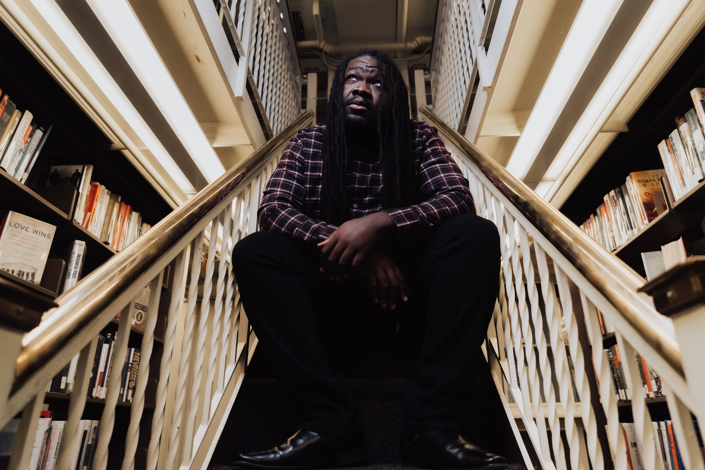
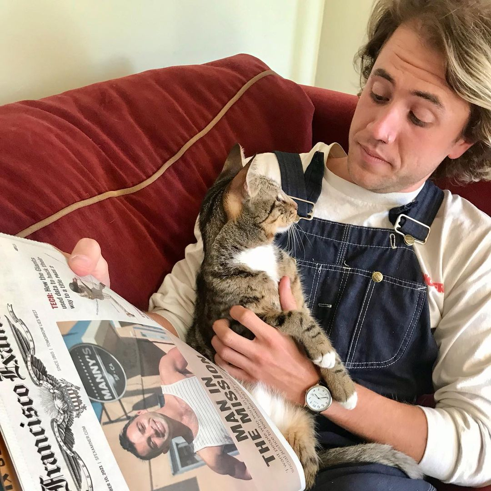

Title: Curators
Slug: curators
Summary: About the Living Room Reading Series & Salon curators.
Lang: en
header_cover: ../static/images/about-header.png

<h2>Meet the Curators</h2>

**[Kevin Dublin](https://www.kevindublin.com)** is an educator, editor, and writer of poetry, prose, scripts, and code. Currently Director of the Elder Writing Project, a community-based outreach program of the Litquake Foundation, Kevin loves teaching in the community. He is a Writers Studio Ralph Dickey Scholar and has received fellowships, grants, and awards from the San Francisco Arts Commission (SFAC), Center for Cultural Innovation (CCI), Martha’s Vineyard Institute of Creative Writing, and the North Carolina Poetry Society.  His words have recently appeared or forthcoming  in *The San Franciscan*, *Cincinnati Review*, *North Carolina Literary Review*, & more. He is author of the chapbook *[How to Fall in Love in San Diego](https://www.finishinglinepress.com/product/how-to-fall-in-love-in-san-diego/)*, and he believes in you. You can find him on Twitter [@PartEverything](https://twitter.com/parteverything).

**[Paolo Bicchieri](https://www.paolobicchieri.com/)** is a writer living on the coast. His poetry has been featured with Nomadic Press, Quiet Lightning, Bay Area Generations, Ghost City Press, Animal Heart Press, y mas. His journalism can be found in *Eater*, *SF Weekly* (RIP), *San Francisco Examiner*, *KQED*, y mas. He was the recipient of the Teach! Write! Play! Fellowship from the Martha's Vineyard Creative Writing Institute in 2019, and co-founded the Zoom reading series *Something Ordinary* in 2020. He's got four books including his debut book of poetry *[Familial Animals](https://animalheartpress.net/familial-animals/),* released in the fall of 2021. He's also a queer white latinx living in the fall of the American empire who thinks teachers deserve the money that cops do not.
