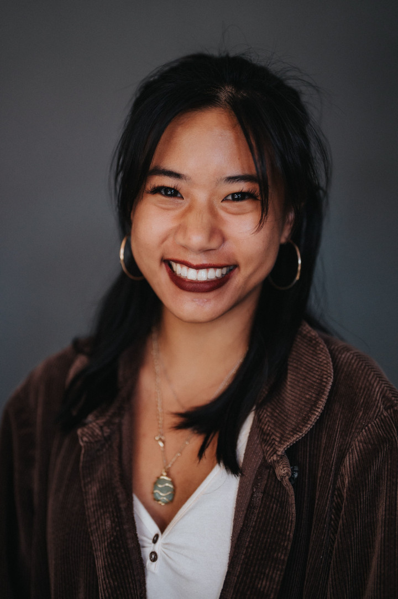

Title: Curators
Slug: curators
Summary: About the Living Room Reading Series & Salon curators.
Lang: en
header_cover: ../static/images/about-header.png

<h2>Meet the Curators</h2>

**[Kevin Dublin](https://www.kevindublin.com)** is an educator, editor, and writer of poetry, prose, scripts, and code. Currently Director of the Elder Writing Project, a community-based outreach program of the Litquake Foundation, Kevin loves teaching in the community. He is a Writers Studio Ralph Dickey Scholar and has received fellowships, grants, and awards from the San Francisco Arts Commission (SFAC), Center for Cultural Innovation (CCI), Martha’s Vineyard Institute of Creative Writing, and the North Carolina Poetry Society.  His words have recently appeared or forthcoming  in *The San Franciscan*, *Cincinnati Review*, *North Carolina Literary Review*, & more. He is author of the chapbook *[How to Fall in Love in San Diego](https://www.finishinglinepress.com/product/how-to-fall-in-love-in-san-diego/)*, and he believes in you. You can find him on Twitter [@PartEverything](https://twitter.com/parteverything).

[**Giovanna Lomanto**](http://giovannalomanto.com/) is a Bay Area poet and teaching artist with a passion for investigating self-liberation through the arts. An alumnus of U.C. Berkeley and a current MFA candidate at NYU's low-residency program, she finds power in education, and therefore holds a passion for delivering that same power to youth—in classrooms, workshops, and mentorships. Her work has been featured on KALW, the Worth-Ryder Art Gallery, the Flor y Canto Literary Festival, Box, and the Elevation Review. She is the author of two poetry collections: [*no body in particular*](https://www.thescrambler.com/no-body-in-particular.html) (Scrambler Books, 2019) and *jupiter fell out the sky last night* (Bound to Brew, 2021). You can follow her on Instagram [@giovanna_lomanto](https://www.instagram.com/giovanna_lomanto/) for updates on future projects. She currently resides in Oakland, CA with her friends, most notably her lionhead bunny Maggie.
