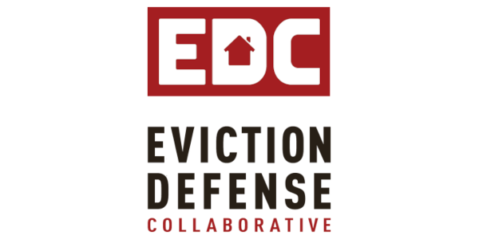
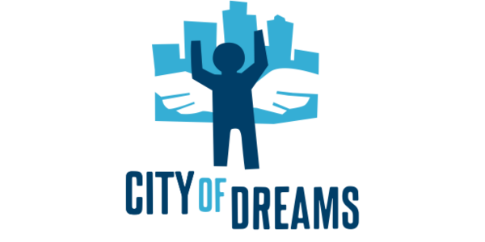
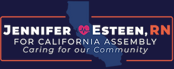

Title: Community Partners
Slug: partners
Summary: About the Living Room's community partners
header_cover: ../static/images/partners-header.jpg

You can still donate or volunteer with any of our community partners:

Community Partner: The **[Eviction Defense Collaborative](https://evictiondefense.org/)** is the principal organization in San Francisco helping low-income tenants respond to eviction lawsuits. Each year they provide emergency legal services and rental assistance to over 5,000 tenants in San Francisco.

Community Partner: The [**City of Dreams** Mentoring Program](https://www.cityofdreams.org/) helps San Francisco Youth who live in public housing, ages 8-24, discover and achieve their potential by offering them experiences and mentorship.

Community Partner: Progressive California AD candidate **[Jennifer Esteen](https://www.jenniferesteen.com/)**. Jennifer is a nurse, mother, and trustee of Alameda Health Systems, and has already helped usher legislation into existence. She knows firsthand the struggles that our families and communities face and will work tirelessly to ensure corporations and special interests pay their fair share, so everyone has access to housing they can afford, healthcare they deserve, and a quality education.

