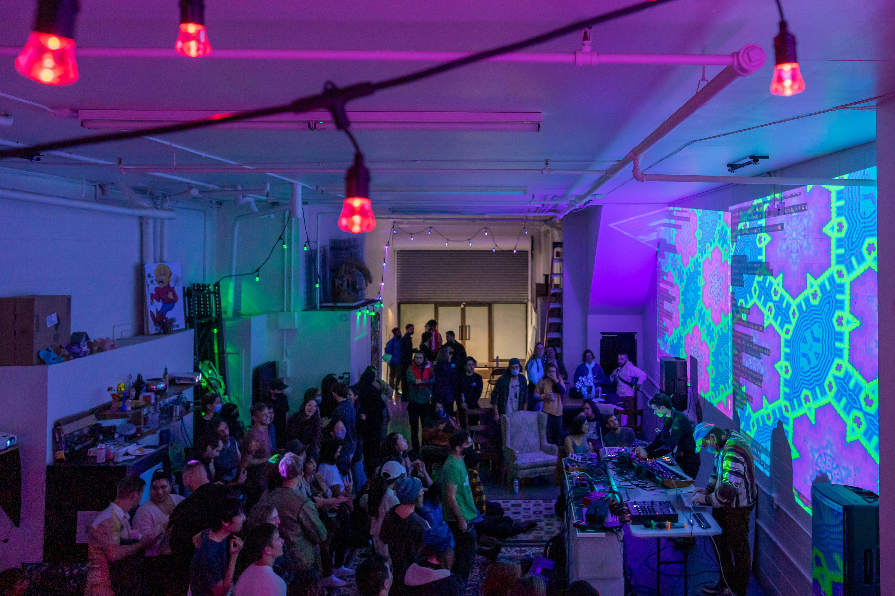

Title: The Space
Slug: venue
Summary: About Syzygy SF, where the Living Room Reading Series & Salon takes place.
Lang: en
header_cover: ../static/images/venue-header-2.jpg

[Syzygy SF](https://www.syzygysf.com/) is a group of artists, musicians, makers, programmers and more, who are building a creative community in the Mission district of San Francisco. Our mission is to create a space where people from all backgrounds can inspire each other, collaborate, and keep the spirit of all that is weird and creative alive in SF. 

[Syzygy membership](https://checkout.square.site/merchant/ML1VKVYXB3VR6/checkout/UXZBX7SJSR5WUTLCD7F4DT6N) is a great way to support us as a nonprofit collective! Your contribution helps us keep our events and facilities highly accessible to people of all financial backgrounds while also helping pay for our rent!

​Membership costs $10 a month and also comes with two great benefits:

 - Exclusive access to private events for you and your friends.
 - First notice on opportunities to exhibit art and perform at Syzygy events.

Talk to us on [Slack](https://join.slack.com/t/syzygysf/shared_invite/zt-vrfb2liu-GzfjEfMq0uOAUzrXCtxJxg) or email us at [someone@syzygysf.com](someone@syzygysf.com)!

395 South Van Ness Ave
San Francisco, CA 94103
