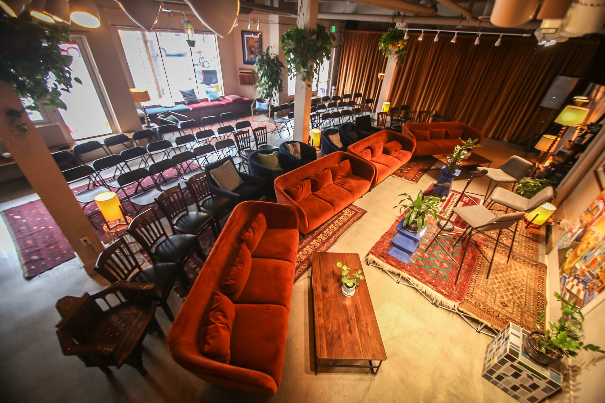

Title: The Space
Slug: venue
Summary: About Manny's, where the Living Room Reading Series & Salon takes place.
Lang: en
header_cover: ../static/images/venue-header.jpg

[Manny's](https://welcometomannys.com/) is a community focused meeting and learning place in San Francisco's Mission District. It houses a non-profit restaurant that partners with [Farming Hope](https://farminghope.org/), a political bookshop, and consistently hosts [civic events & music](https://welcometomannys.com/events). It's open Tuesday - Friday: 11AM - 7PM and Saturday - Sunday: 10AM-7PM. You should [join their mailing list](http://eepurl.com/gq22Vv) to keep up to date with all that's going on.
